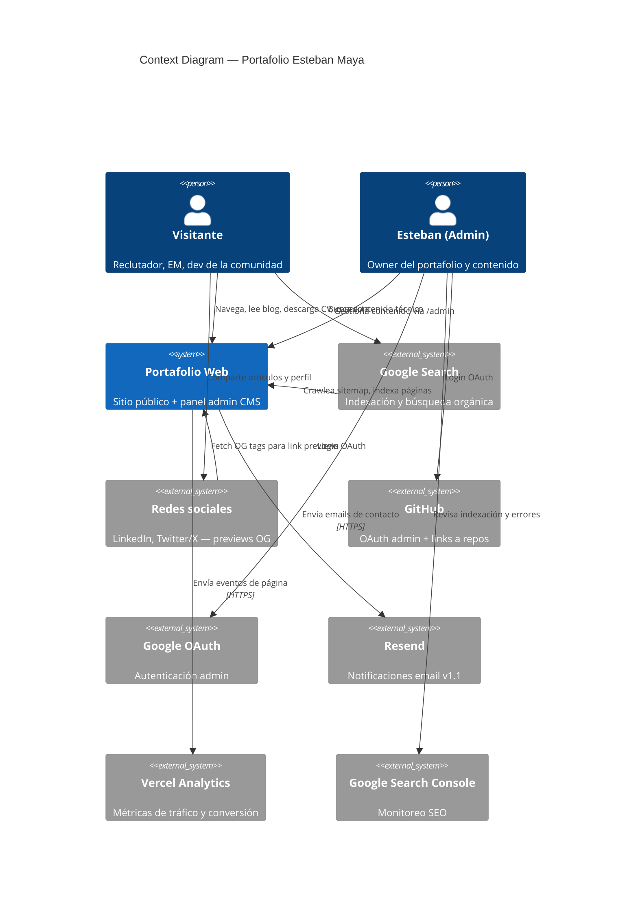
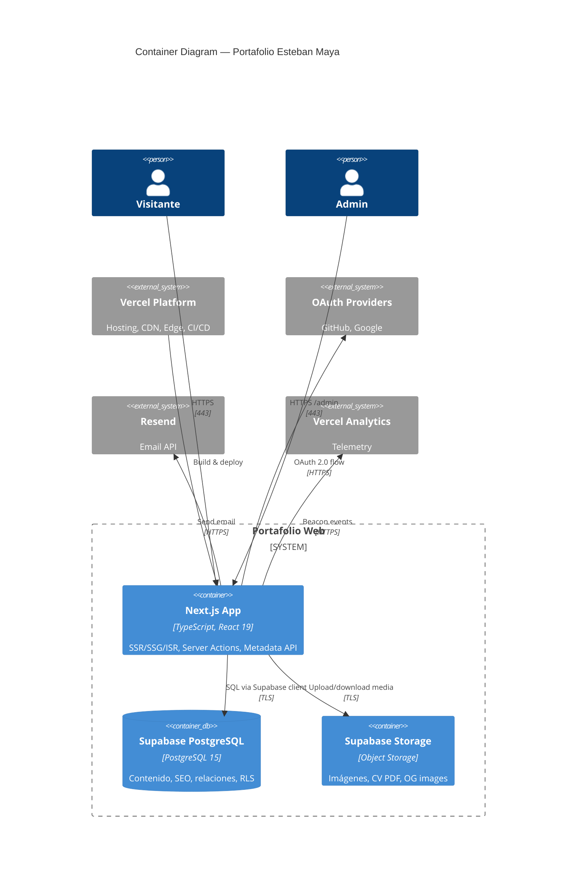
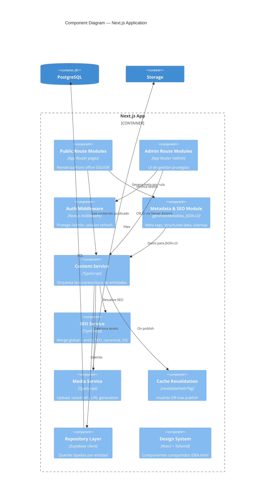
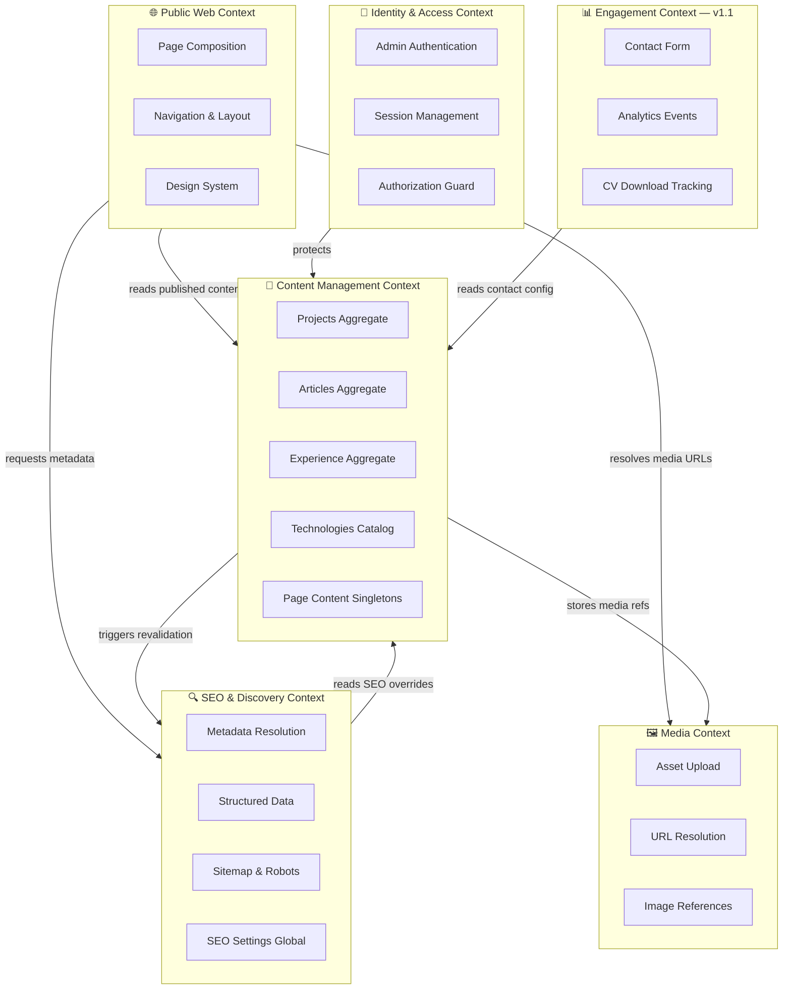

# Architecture — Portafolio Profesional & Marca Personal
## Esteban Maya | Software Engineer

| Campo | Valor |
|-------|-------|
| **Versión** | 1.0 |
| **Fecha** | 18 de junio de 2026 |
| **Autor** | Solution Architecture |
| **Estado** | Approved for Implementation |
| **Documentos relacionados** | [PRD.md](./PRD.md), [IDEA.html](./IDEA.html) |

---

## Tabla de contenidos

1. [Resumen ejecutivo](#1-resumen-ejecutivo)
2. [Arquitectura general](#2-arquitectura-general)
3. [Context Diagram](#3-context-diagram)
4. [C4 Model](#4-c4-model)
5. [Bounded Contexts](#5-bounded-contexts)
6. [Componentes](#6-componentes)
7. [Integraciones](#7-integraciones)
8. [Estrategia SEO](#8-estrategia-seo)
9. [Estrategia CMS](#9-estrategia-cms)
10. [Estrategia de contenido](#10-estrategia-de-contenido)
11. [Escalabilidad](#11-escalabilidad)
12. [Decisiones arquitectónicas (ADRs)](#12-decisiones-arquitectónicas-adrs)
13. [Apéndices](#13-apéndices)

---

## 1. Resumen ejecutivo

Este documento define la arquitectura de referencia para el portafolio de Esteban Maya: una **aplicación web monolítica modular** desplegada en Vercel, con **Next.js 15 (App Router)** como capa de presentación y API, y **Supabase (PostgreSQL)** como fuente de verdad del contenido.

La arquitectura prioriza tres fuerzas en tensión:

| Fuerza | Implicación arquitectónica |
|--------|---------------------------|
| **SEO y performance** | Renderizado estático + ISR; HTML completo en primera respuesta |
| **CMS sin código** | Admin custom integrado; mutaciones vía Server Actions |
| **Simplicidad operativa** | Un solo repositorio, un solo deploy, un solo admin |

**Patrón arquitectónico elegido:** *Headless Monolith* — frontend y backoffice en la misma codebase Next.js, contenido desacoplado en Postgres vía capa de repositorio.

**No se implementa en este documento.** Este artefacto es la guía para el desarrollo.

---

## 2. Arquitectura general

### 2.1 Vista de alto nivel

```
┌─────────────────────────────────────────────────────────────────────────┐
│                           VERCEL EDGE NETWORK                           │
│  ┌──────────────┐  ┌──────────────┐  ┌──────────────┐  ┌─────────────┐ │
│  │ CDN / Cache  │  │ Middleware   │  │ OG Image Gen │  │ Analytics   │ │
│  └──────┬───────┘  └──────┬───────┘  └──────────────┘  └─────────────┘ │
└─────────┼─────────────────┼─────────────────────────────────────────────┘
          │                 │
          ▼                 ▼
┌─────────────────────────────────────────────────────────────────────────┐
│                    NEXT.JS 15 APPLICATION (Monolith)                    │
│                                                                         │
│  ┌─────────────────────────────┐  ┌─────────────────────────────────┐ │
│  │       FRONT OFFICE          │  │         BACK OFFICE             │ │
│  │  (Public Routes — SSG/ISR)  │  │    (Admin Routes — SSR + Auth)  │ │
│  │                             │  │                                 │ │
│  │  /  /about  /experience     │  │  /admin/projects                │ │
│  │  /projects  /blog  /contact │  │  /admin/articles                │ │
│  │  /sitemap.xml  /robots.txt  │  │  /admin/experience  /admin/seo │ │
│  └──────────────┬──────────────┘  └──────────────┬──────────────────┘ │
│                 │                                │                     │
│  ┌──────────────┴────────────────────────────────┴──────────────────┐ │
│  │                     APPLICATION LAYER                            │ │
│  │  Server Components │ Server Actions │ Route Handlers │ Metadata  │ │
│  └──────────────┬───────────────────────────────────────────────────┘ │
│                 │                                                     │
│  ┌──────────────┴───────────────────────────────────────────────────┐ │
│  │                     DOMAIN / REPOSITORY LAYER                    │ │
│  │  ContentService │ SeoService │ MediaService │ AuthGuard         │ │
│  └──────────────┬───────────────────────────────────────────────────┘ │
└─────────────────┼───────────────────────────────────────────────────┘
                  │
     ┌────────────┼────────────┬──────────────┬──────────────┐
     ▼            ▼            ▼              ▼              ▼
┌─────────┐ ┌──────────┐ ┌──────────┐ ┌────────────┐ ┌────────────┐
│Supabase │ │ Supabase │ │  Vercel  │ │   Resend   │ │  External  │
│Postgres │ │ Storage  │ │   Blob   │ │  (email)   │ │  (OAuth)   │
│  + RLS  │ │ (media)  │ │ (alt.)   │ │   v1.1     │ │ GitHub/G   │
└─────────┘ └──────────┘ └──────────┘ └────────────┘ └────────────┘
```

### 2.2 Capas lógicas

| Capa | Responsabilidad | Tecnología |
|------|-----------------|------------|
| **Edge / CDN** | Cache de assets estáticos, TLS, geo-routing | Vercel Edge Network |
| **Presentation** | UI pública y admin, layouts, design system | React 19 + Tailwind CSS |
| **Application** | Orquestación, validación, auth checks, revalidación | Next.js Server Components / Actions |
| **Domain** | Reglas de negocio (publish, slug, SEO merge) | TypeScript modules |
| **Infrastructure** | Persistencia, storage, email, auth provider | Supabase, Resend |

### 2.3 Flujos principales

#### Flujo de lectura (visitante)

```
Browser → CDN (cache hit?) → Next.js Server Component → Repository → Postgres
                              ↓
                         HTML + metadata + JSON-LD
```

**Justificación:** Server Components evitan enviar JS innecesario al cliente. SSG/ISR garantizan TTFB bajo y HTML indexable por crawlers sin depender de JavaScript.

#### Flujo de escritura (admin)

```
Admin UI → Server Action → Auth middleware → Domain validation → Repository → Postgres
                                                      ↓
                                            revalidatePath / revalidateTag
                                                      ↓
                                            CDN cache invalidation
```

**Justificación:** Server Actions eliminan la necesidad de una API REST separada para el MVP. La revalidación on-demand mantiene coherencia entre CMS y front office sin rebuild completo.

### 2.4 Principios arquitectónicos

| Principio | Aplicación |
|-----------|------------|
| **Content as data** | Todo el contenido editable vive en Postgres, no en archivos MDX en repo |
| **SEO-first rendering** | Metadata y JSON-LD generados server-side por ruta |
| **Single writer** | Un admin; sin conflictos de concurrencia complejos |
| **Progressive enhancement** | Front office funcional sin JS; admin requiere JS |
| **Fail secure** | RLS en DB + middleware en app; admin nunca expuesto en sitemap |
| **Boring technology** | Stack probado (Next + Postgres) sobre microservicios prematuros |

---

## 3. Context Diagram

Diagrama de contexto del sistema (C4 Level 1): actores externos y sistemas con los que interactúa el portafolio.



### Actores y sistemas

| Elemento | Tipo | Interacción |
|----------|------|-------------|
| **Visitante** | Persona | Consume front office; no autenticado |
| **Esteban (Admin)** | Persona | CRUD de contenido; autenticado |
| **Portafolio Web** | Sistema central | Front office + back office + SEO |
| **Google Search** | Sistema externo | Crawlea `/sitemap.xml`, `/robots.txt`, páginas públicas |
| **Redes sociales** | Sistema externo | Consume meta OG/Twitter al compartir URLs |
| **GitHub / Google** | IdP | OAuth para login admin |
| **Resend** | SaaS | Emails transaccionales (formulario contacto, v1.1) |
| **Vercel Analytics** | SaaS | Page views, Web Vitals |

---

## 4. C4 Model

### 4.1 Level 1 — System Context

*(Ver sección 3.)*

El sistema **Portafolio Web** es la frontera de responsabilidad: todo lo que ocurre bajo el dominio `estebanmaya.dev` es responsabilidad del equipo de uno (Esteban).

---

### 4.2 Level 2 — Container Diagram



#### Contenedores

| Contenedor | Descripción | Justificación |
|------------|-------------|---------------|
| **Next.js App** | Aplicación full-stack: rutas públicas, admin, API routes (sitemap, webhooks) | Un contenedor reduce complejidad operativa; Next.js cubre SSG + admin + metadata nativa |
| **Supabase PostgreSQL** | Base relacional con RLS | Modelo relacional (Technology ↔ Project ↔ Experience); backups automáticos; tier free suficiente para MVP |
| **Supabase Storage** | Bucket privado/público para media | Integración nativa con Supabase Auth; URLs firmadas para admin; URLs públicas para OG/blog |
| **Vercel Platform** | Hosting serverless | Preview deploys por PR; integración zero-config con Next.js; edge cache global |

**Alternativa descartada — Sanity/Contentful:** headless CMS SaaS excelente para equipos editoriales, pero añade costo, curva de aprendizaje y modelado menos natural para relaciones many-to-many (Technology). Para un solo admin con schema relacional fijo, Postgres + admin custom es más simple y barato.

**Alternativa descartada — MDX en repo:** contradice el OKR "cero commits por actualización de texto" del PRD.

---

### 4.3 Level 3 — Component Diagram (Next.js App)



#### Componentes internos

| Componente | Responsabilidad |
|------------|-----------------|
| **Public Route Modules** | Páginas `/`, `/about`, `/experience`, `/projects`, `/blog`, `/contact` |
| **Admin Route Modules** | CRUD UI bajo `/admin/*` |
| **Auth Middleware** | Redirect si no hay sesión válida en rutas admin |
| **Metadata & SEO Module** | `generateMetadata()`, JSON-LD, `sitemap.ts`, `robots.ts` |
| **Content Service** | Lógica de publish, slug generation, validación de estados |
| **SEO Service** | Resolución: `entity.seo ?? globalDefaults`; title template |
| **Media Service** | Upload a Storage; validación MIME; generación de paths |
| **Cache Revalidation** | Tags por entidad: `article:{slug}`, `projects`, `experience` |
| **Repository Layer** | Aislamiento de queries Supabase; tipos generados |
| **Design System** | Button, Card, Badge, Timeline, etc. (tokens de IDEA.html) |

---

## 5. Bounded Contexts

Aplicando **Domain-Driven Design** ligero: contextos delimitados con responsabilidades claras y contratos explícitos. No implica microservicios — todos los contextos viven en el monolito Next.js.



### 5.1 Mapa de contextos

| Bounded Context | Agregados raíz | Ubicación en código |
|-----------------|----------------|---------------------|
| **Public Web** | N/A (read-only views) | `app/(public)/`, `components/` |
| **Content Management** | Project, Article, Experience, Technology, PageContent | `app/admin/`, `lib/domain/content/` |
| **Identity & Access** | AdminUser (Supabase Auth) | `middleware.ts`, `lib/auth/` |
| **SEO & Discovery** | SeoSettings + SeoFields (value object) | `lib/domain/seo/`, `app/sitemap.ts` |
| **Media** | MediaAsset | `lib/domain/media/` |
| **Engagement** | ContactMessage | `app/api/contact/` (v1.1) |

### 5.2 Context Mapping (relaciones entre contextos)

| Upstream | Downstream | Patrón | Descripción |
|----------|------------|--------|-------------|
| Content Management | Public Web | **Published Language** | Solo entidades `status=published` cruzan la frontera |
| SEO & Discovery | Public Web | **Shared Kernel** | `SeoFields` value object compartido |
| Identity & Access | Content Management | **ACL** | Middleware traduce sesión OAuth a `AdminUser` |
| Media | Content Management | **Customer-Supplier** | Content almacena refs; Media resuelve URLs |
| Engagement | Content Management | **Conformist** | Lee config de contacto desde PageContent |

### 5.3 Justificación DDD ligero

Para un producto de un solo desarrollador, DDD completo (event sourcing, CQRS) sería over-engineering. Los bounded contexts sirven para:

1. **Organizar carpetas** con fronteras claras.
2. **Evitar acoplamiento** entre admin y public (ej. drafts nunca filtrados al front).
3. **Preparar evolución** (v2 API pública puede extraer Content Management sin rewrite).

---

## 6. Componentes

### 6.1 Mapa de módulos (estructura de proyecto propuesta)

```
portfolio/
├── app/
│   ├── (public)/                 # Public Web Context
│   │   ├── layout.tsx
│   │   ├── page.tsx                # Home
│   │   ├── about/page.tsx
│   │   ├── experience/page.tsx
│   │   ├── projects/page.tsx
│   │   ├── blog/
│   │   │   ├── page.tsx
│   │   │   └── [slug]/page.tsx
│   │   └── contact/page.tsx
│   ├── admin/                      # Content Management + Identity
│   │   ├── layout.tsx              # Admin shell (auth required)
│   │   ├── projects/
│   │   ├── articles/
│   │   ├── experience/
│   │   ├── technologies/
│   │   └── seo/
│   ├── sitemap.ts                  # SEO Context
│   ├── robots.ts
│   └── api/
│       └── revalidate/route.ts     # On-demand ISR webhook
├── components/
│   ├── ui/                         # Design System
│   ├── public/                     # Page-specific public components
│   └── admin/                      # Admin forms, tables
├── lib/
│   ├── auth/                       # Identity Context
│   ├── domain/
│   │   ├── content/                # Aggregates, validators
│   │   ├── seo/                    # SEO resolution
│   │   └── media/                  # Upload logic
│   ├── repositories/               # Supabase queries
│   └── supabase/
│       ├── client.ts               # Browser client
│       ├── server.ts               # Server client
│       └── middleware.ts           # Session refresh
├── supabase/
│   └── migrations/                 # SQL schema + RLS
└── types/
    └── database.ts                 # Generated types
```

### 6.2 Componentes de front office

| Componente | Tipo | Datos | Render |
|------------|------|-------|--------|
| `HeroSection` | Server Component | PageContent.hero | SSG + revalidate |
| `ImpactMetrics` | Server Component | PageContent.metrics[] | SSG |
| `BioBridgeTable` | Server Component | PageContent.bioBridge[] | SSG |
| `ExperienceTimeline` | Server Component | Experience[] + Technology[] | ISR (tag: experience) |
| `ProjectGrid` | Server Component | Project[] (published) | ISR (tag: projects) |
| `ArticleCard` | Server Component | Article (teaser) | ISR (tag: articles) |
| `ArticleContent` | Server Component | Article.content (MD) | ISR per slug |
| `ContactCTA` | Server Component | PageContent.contact | SSG |
| `Header` / `Footer` | Server Component | Nav static + social links | SSG |
| `MobileMenu` | Client Component | — | Hydration mínima |

**Justificación Client vs Server:** solo componentes con interactividad (menú móvil, formularios admin) son Client Components. Esto maximiza HTML estático enviado al crawler y minimiza bundle JS.

### 6.3 Componentes de back office

| Componente | Tipo | Función |
|------------|------|---------|
| `AdminShell` | Server + Client | Layout sidebar, nav admin |
| `ProjectForm` | Client | Create/edit project; Server Action submit |
| `ArticleEditor` | Client | Markdown editor (ej. `@uiw/react-md-editor`) |
| `ExperienceForm` | Client | Timeline entry CRUD |
| `TechnologyPicker` | Client | Multi-select from catalog |
| `SeoPreview` | Client | Simula snippet Google + OG card |
| `MediaUploader` | Client | Drag-drop → Supabase Storage |
| `PublishButton` | Client | Cambia status + trigger revalidation |

### 6.4 Servicios de dominio

#### ContentService

```typescript
// Responsabilidades (pseudointerfaz)
interface ContentService {
  publishArticle(id: string): Promise<void>;   // status → published, set publishedAt
  generateSlug(title: string, entity: string): Promise<string>;
  getPublishedProjects(): Promise<Project[]>;
  getFeaturedProjects(limit: number): Promise<Project[]>;
  getLatestArticles(limit: number): Promise<Article[]>;
}
```

**Reglas de negocio:**
- Slug único por entidad; auto-suffix `-2`, `-3` en colisión.
- Draft nunca expuesto en queries públicas (doble check: query + RLS).
- `publishedAt` se setea automáticamente en primera publicación.

#### SeoService

```typescript
interface SeoService {
  resolvePageMeta(entity: SeoEntity | null, path: string): ResolvedSeo;
  buildJsonLd(type: SchemaType, data: unknown): object;
  shouldIndex(entity: { status: string; noindex?: boolean }): boolean;
}
```

**Regla de merge:** `title = entity.seo.title ?? template(entity.title) ?? global.defaultTitle`

---

## 7. Integraciones

### 7.1 Mapa de integraciones

| Sistema | Dirección | Protocolo | Propósito | Fase |
|---------|-----------|-----------|-----------|------|
| **Supabase PostgreSQL** | App → DB | HTTPS + PostgreSQL wire | Persistencia contenido | MVP |
| **Supabase Storage** | App → Storage | HTTPS REST | Media assets | MVP |
| **Supabase Auth** | App ↔ Auth | OAuth 2.0 / JWT | Login admin | MVP |
| **GitHub OAuth** | Admin → GitHub | OAuth 2.0 | IdP primario (dev identity) | MVP |
| **Google OAuth** | Admin → Google | OAuth 2.0 | IdP alternativo | MVP |
| **Vercel Platform** | Git → Vercel | Webhook / CLI | CI/CD, hosting | MVP |
| **Vercel Analytics** | Browser → Vercel | Beacon | Page views, vitals | MVP |
| **Resend** | App → Resend | HTTPS REST | Email contacto | v1.1 |
| **Cloudflare Turnstile** | Browser → CF | Widget JS | Anti-spam formulario | v1.1 |
| **Google Search Console** | Manual | — | Monitoreo SEO | MVP (manual) |
| **Plausible** | Browser → Plausible | Script | Analytics privacy-first | v1.1 |

### 7.2 Integración Supabase — detalle

```
┌─────────────┐     anon key (public)      ┌─────────────┐
│  Front Office│ ─── SELECT published ────► │  PostgreSQL │
│  (Server)   │     RLS: status=published  │  + RLS      │
└─────────────┘                             └─────────────┘

┌─────────────┐     service role / user JWT  ┌─────────────┐
│  Admin      │ ─── INSERT/UPDATE/DELETE ──► │  PostgreSQL │
│  (Server)   │     RLS: auth.uid() = admin  │  + RLS      │
└─────────────┘                             └─────────────┘
```

**Justificación RLS:** defensa en profundidad. Aunque la app filtre drafts, RLS garantiza que una query mal escrita o un key leak no exponga contenido privado.

**Políticas RLS propuestas:**

| Tabla | SELECT público | INSERT/UPDATE/DELETE |
|-------|----------------|----------------------|
| projects | `status = 'published'` | `auth.uid() IN (admin_ids)` |
| articles | `status = 'published'` | `auth.uid() IN (admin_ids)` |
| experiences | `true` (todo publicable) | admin only |
| technologies | `true` | admin only |
| seo_settings | `true` | admin only |
| page_content | `true` | admin only |

### 7.3 Integración Auth

**Flujo OAuth (Supabase Auth + GitHub):**

```
Admin → /admin/login → Supabase Auth → GitHub OAuth
  → Callback → Session cookie (HTTP-only, Secure, SameSite=Lax)
  → Middleware refresh → /admin dashboard
```

**Justificación GitHub como IdP primario:** coherente con identidad de Software Engineer; reduce fricción (Esteban ya tiene cuenta activa).

**Single admin:** tabla `admin_users` con whitelist de UUIDs autorizados post-OAuth. Usuarios OAuth no autorizados reciben 403.

### 7.4 Integración CI/CD (Vercel)

| Evento | Acción |
|--------|--------|
| Push to `main` | Production deploy |
| Pull request | Preview deploy con URL única |
| Env vars | `SUPABASE_URL`, `SUPABASE_ANON_KEY`, `SUPABASE_SERVICE_ROLE_KEY` en Vercel |
| Post-deploy | Smoke test: `/`, `/sitemap.xml`, `/admin/login` |

---

## 8. Estrategia SEO

### 8.1 Objetivo

Lograr **Lighthouse SEO ≥ 95** y indexación completa de URLs públicas en ≤ 14 días, posicionando tanto la marca personal (`"Esteban Maya Software Engineer"`) como contenido técnico long-tail del blog.

### 8.2 Arquitectura SEO

```
┌─────────────────────────────────────────────────────────────┐
│                    SEO PIPELINE (per request)               │
│                                                             │
│  Route Request                                              │
│       │                                                     │
│       ▼                                                     │
│  generateMetadata()  ◄── SeoService.resolvePageMeta()       │
│       │                                                     │
│       ├── title (template: "{page} | Esteban Maya")         │
│       ├── description                                       │
│       ├── canonical URL                                     │
│       ├── robots (index/noindex)                            │
│       ├── openGraph { title, description, image, url }      │
│       └── twitter { card, title, description, image }       │
│                                                             │
│  Page Render                                                │
│       │                                                     │
│       └── <script type="application/ld+json">               │
│             SeoService.buildJsonLd(type, data)                │
│           </script>                                         │
└─────────────────────────────────────────────────────────────┘
```

### 8.3 Estrategia por capa

| Capa | Táctica | Justificación |
|------|---------|---------------|
| **Técnica** | SSG/ISR, HTML completo server-side | Crawlers reciben contenido sin ejecutar JS |
| **Técnica** | `/sitemap.xml` dinámico vía `app/sitemap.ts` | Next.js Metadata Route API genera XML desde DB |
| **Técnica** | `/robots.txt` con `Disallow: /admin/` | Protege back office de indexación |
| **Técnica** | Canonical URLs absolutas | Evita duplicate content en previews Vercel |
| **On-page** | Un `h1` por página; jerarquía h2→h3 en blog | Requisito SEO-06 del PRD |
| **On-page** | URLs semánticas `/blog/hexagonal-architecture-health-api` | Keywords en URL; legibilidad humana |
| **Structured Data** | JSON-LD: Person, WebSite, BlogPosting, WorkExperience | Rich results; Knowledge Panel potencial |
| **Social** | OG images 1200×630 por entidad | CTR en shares LinkedIn/Twitter |
| **Performance** | CWV "Good" — LCP < 2.5s | Ranking factor Google; señal de calidad técnica |
| **Content** | Internal linking blog → projects | PageRank interno; contexto para crawlers |

### 8.4 Schema JSON-LD por ruta

| Ruta | Schema | Campos clave |
|------|--------|--------------|
| `/` | `Person` + `WebSite` | name, jobTitle, url, sameAs[], potentialAction |
| `/about` | `Person` | description, knowsAbout, alumniOf |
| `/experience` | `ProfilePage` + items `OrganizationRole` | worksFor, roleName, startDate |
| `/blog/[slug]` | `BlogPosting` | headline, author, datePublished, image, wordCount |
| `/projects/[slug]` | `SoftwareSourceCode` o `CreativeWork` | name, description, programmingLanguage |

### 8.5 Sitemap — estrategia de generación

```typescript
// Pseudológica app/sitemap.ts
export default async function sitemap(): Promise<MetadataRoute.Sitemap> {
  const staticRoutes = ['/', '/about', '/experience', '/projects', '/blog', '/contact'];
  const projects = await repo.getPublishedProjects();
  const articles = await repo.getPublishedArticles();

  return [
    ...staticRoutes.map(route => ({ url, lastModified, changeFrequency, priority })),
    ...projects.map(p => ({ url: `/projects/${p.slug}`, priority: 0.8 })),
    ...articles.map(a => ({ url: `/blog/${a.slug}`, lastModified: a.updatedAt, priority: 0.7 })),
  ];
}
```

**Exclusiones:** drafts, `/admin/*`, preview URLs de Vercel (via `robots.txt` + header `X-Robots-Tag: noindex` en non-prod).

### 8.6 Estrategia de indexación

| Fase | Acción |
|------|--------|
| Pre-launch | Validar sitemap localmente; probar OG con LinkedIn Debugger |
| Launch | Submit sitemap en Google Search Console |
| Semana 1 | Verificar indexación de 6 rutas estáticas + 1er artículo |
| Mensual | Revisar Coverage report; corregir 404/redirects |
| Por publicación | Ping sitemap (automático via ISR revalidation) |

### 8.7 SEO en entornos no-producción

| Entorno | Estrategia |
|---------|------------|
| Preview (PR) | `X-Robots-Tag: noindex, nofollow` via middleware |
| Staging | Mismo que preview; dominio no indexable |
| Production | Indexable; canonical apunta a dominio final |

---

## 9. Estrategia CMS

### 9.1 Decisión: CMS custom integrado (no headless SaaS)

| Criterio | CMS Custom (elegido) | Sanity / Contentful |
|----------|---------------------|---------------------|
| Relaciones M:N (Technology) | Nativo en Postgres | Workarounds (references) |
| Costo | $0 (Supabase free tier) | $0–99/mes |
| Control UI admin | Total | Limitado a su Studio |
| Curva aprendizaje | Baja (ya conoce Next.js) | Media |
| OKR "sin commits" | ✓ | ✓ |
| Vendor lock-in | Bajo | Medio |

**Conclusión:** para un solo admin, schema estable y relaciones relacionales, **admin custom en Next.js + Supabase** es la opción óptima en costo, control y simplicidad.

### 9.2 Arquitectura CMS

```
┌──────────────────────────────────────────────────────────────┐
│                     ADMIN (/admin)                           │
│                                                              │
│  ┌──────────┐ ┌──────────┐ ┌──────────┐ ┌──────────┐        │
│  │ Projects │ │ Articles │ │Experience│ │   SEO    │        │
│  │   CRUD   │ │   CRUD   │ │   CRUD   │ │ Settings │        │
│  └────┬─────┘ └────┬─────┘ └────┬─────┘ └────┬─────┘        │
│       │            │            │            │               │
│       └────────────┴────────────┴────────────┘               │
│                         │                                    │
│                         ▼                                    │
│              Server Actions (mutations)                      │
│                         │                                    │
│         ┌───────────────┼───────────────┐                      │
│         ▼               ▼               ▼                      │
│    Validation      ContentService    revalidateTag()           │
│    (Zod schema)    → Repository    → ISR invalidation        │
└──────────────────────────────────────────────────────────────┘
```

### 9.3 Modelo de contenido (schema Postgres)

```sql
-- Simplificado; migraciones completas en implementación

CREATE TYPE content_status AS ENUM ('draft', 'published');
CREATE TYPE tech_category AS ENUM ('language', 'framework', 'infra', 'database', 'tool');

-- Catálogo compartido
CREATE TABLE technologies (
  id UUID PRIMARY KEY DEFAULT gen_random_uuid(),
  name TEXT NOT NULL,
  slug TEXT UNIQUE NOT NULL,
  category tech_category NOT NULL,
  icon_url TEXT,
  created_at TIMESTAMPTZ DEFAULT now()
);

CREATE TABLE projects (
  id UUID PRIMARY KEY DEFAULT gen_random_uuid(),
  title TEXT NOT NULL,
  slug TEXT UNIQUE NOT NULL,
  category TEXT NOT NULL,
  problem TEXT NOT NULL,
  solution TEXT NOT NULL,
  result TEXT NOT NULL,
  github_url TEXT,
  demo_url TEXT,
  featured BOOLEAN DEFAULT false,
  status content_status DEFAULT 'draft',
  sort_order INT DEFAULT 0,
  seo_title TEXT,
  seo_description TEXT,
  seo_og_image TEXT,
  seo_canonical TEXT,
  seo_noindex BOOLEAN DEFAULT false,
  created_at TIMESTAMPTZ DEFAULT now(),
  updated_at TIMESTAMPTZ DEFAULT now()
);

CREATE TABLE project_technologies (
  project_id UUID REFERENCES projects(id) ON DELETE CASCADE,
  technology_id UUID REFERENCES technologies(id) ON DELETE CASCADE,
  PRIMARY KEY (project_id, technology_id)
);

CREATE TABLE articles (
  id UUID PRIMARY KEY DEFAULT gen_random_uuid(),
  title TEXT NOT NULL,
  slug TEXT UNIQUE NOT NULL,
  excerpt TEXT NOT NULL CHECK (char_length(excerpt) BETWEEN 160 AND 320),
  content TEXT NOT NULL,  -- Markdown
  tags TEXT[] DEFAULT '{}',
  cover_image_url TEXT,
  status content_status DEFAULT 'draft',
  published_at TIMESTAMPTZ,
  reading_time_min INT,  -- computed on save
  seo_title TEXT,
  seo_description TEXT,
  seo_og_image TEXT,
  seo_canonical TEXT,
  seo_noindex BOOLEAN DEFAULT false,
  created_at TIMESTAMPTZ DEFAULT now(),
  updated_at TIMESTAMPTZ DEFAULT now()
);

CREATE TABLE experiences (
  id UUID PRIMARY KEY DEFAULT gen_random_uuid(),
  company TEXT NOT NULL,
  role TEXT NOT NULL,
  start_date DATE NOT NULL,
  end_date DATE,  -- NULL = Presente
  bullets JSONB NOT NULL DEFAULT '[]',
  sort_order INT DEFAULT 0,
  created_at TIMESTAMPTZ DEFAULT now(),
  updated_at TIMESTAMPTZ DEFAULT now()
);

CREATE TABLE experience_technologies (
  experience_id UUID REFERENCES experiences(id) ON DELETE CASCADE,
  technology_id UUID REFERENCES technologies(id) ON DELETE CASCADE,
  PRIMARY KEY (experience_id, technology_id)
);

CREATE TABLE page_content (
  id TEXT PRIMARY KEY,  -- 'hero', 'about', 'contact'
  data JSONB NOT NULL,
  updated_at TIMESTAMPTZ DEFAULT now()
);

CREATE TABLE seo_settings (
  id INT PRIMARY KEY DEFAULT 1 CHECK (id = 1),  -- singleton
  site_name TEXT NOT NULL,
  title_template TEXT DEFAULT '%s | Esteban Maya',
  default_description TEXT NOT NULL,
  default_og_image TEXT,
  twitter_handle TEXT,
  site_url TEXT NOT NULL,
  updated_at TIMESTAMPTZ DEFAULT now()
);
```

**Justificación JSONB para `page_content`:** hero, about y contact tienen estructuras flexibles (métricas variable, filas bio-bridge) sin necesidad de tablas rígidas. Un singleton por página simplifica queries.

### 9.4 Flujo de publicación

```
┌─────────┐    ┌─────────┐    ┌──────────────┐    ┌─────────────┐
│  Draft  │───►│ Preview │───►│  Published   │───►│ Revalidate  │
│  (save) │    │ (admin) │    │  (publish)   │    │  ISR tags   │
└─────────┘    └─────────┘    └──────────────┘    └─────────────┘
                                     │
                                     ├── set published_at (if null)
                                     ├── compute reading_time
                                     └── update sitemap lastmod
```

### 9.5 Editor de artículos

| Fase | Editor | Justificación |
|------|--------|---------------|
| MVP | Markdown textarea + preview side-by-side | PRD advierte contra WYSIWYG over-engineered; MD es natural para dev |
| v1.1 | MD editor con toolbar (`@uiw/react-md-editor`) | Mejor UX sin complejidad de ProseMirror |
| v2.0 | MDX con componentes embebidos | Solo si se necesitan widgets interactivos en artículos |

**Syntax highlighting en front office:** `shiki` o `rehype-pretty-code` en pipeline MD → HTML server-side.

### 9.6 Gestión de media

| Tipo | Storage | Acceso |
|------|---------|--------|
| Imágenes blog/OG | Supabase Storage `media/` | Público (CDN URL) |
| CV PDF | Supabase Storage `cv/` | Público con URL fija |
| Uploads admin | Server Action → Storage | Autenticado |

**Validación:** max 5MB; MIME whitelist (`image/jpeg`, `image/png`, `image/webp`, `application/pdf`).

### 9.7 Cache e invalidación

| Contenido | Estrategia cache | Tag de revalidación |
|-----------|------------------|---------------------|
| Home | ISR 3600s | `home`, `projects`, `articles` |
| About, Contact | ISR 3600s | `page-content` |
| Experience | ISR 3600s | `experience` |
| Projects list | ISR 3600s | `projects` |
| Blog list | ISR 3600s | `articles` |
| Blog post | ISR 86400s | `article:{slug}` |

**On publish:** Server Action llama `revalidateTag('articles')` + `revalidateTag(`article:${slug}`)`.

**Justificación ISR sobre SSR puro:** 99% de requests servidos desde edge cache; admin publish invalida selectivamente. Balance ideal entre freshness y performance para un sitio de baja frecuencia de actualización (~1-4 edits/semana).

---

## 10. Estrategia de contenido

### 10.1 Content model — tipos y relaciones

```
                    ┌──────────────┐
                    │  PageContent │ (singletons)
                    │ hero, about  │
                    │   contact    │
                    └──────────────┘

┌──────────────┐     M:N     ┌──────────────┐
│  Technology  │◄───────────►│   Project    │
└──────┬───────┘             └──────────────┘
       │ M:N
       ▼
┌──────────────┐             ┌──────────────┐
│  Experience  │             │   Article    │
└──────────────┘             └──────────────┘
       │                            │
       └──────── no direct link ────┘
              (internal links in MD)
```

### 10.2 Taxonomía de contenido

| Tipo | Propósito | Frecuencia de update | Audiencia |
|------|-----------|---------------------|-----------|
| **Hero / Metrics** | Conversión; first impression | Mensual o post-logro | Reclutadores |
| **About / Bio-bridge** | Diferenciación narrativa | Trimestral | EM, reclutadores |
| **Experience** | Credibilidad profesional | Post-cambio de rol | Reclutadores, EM |
| **Projects** | Prueba de impacto técnico | Por proyecto completado | EM, tech leads |
| **Articles (The Lab)** | SEO long-tail; thought leadership | ≥ 1/mes | Comunidad dev |
| **Technologies** | Vocabulario compartido | Ocasional | Todos |

### 10.3 Estrategia editorial (The Lab)

| Pilar | Temas | Keywords objetivo |
|-------|-------|-------------------|
| **Arquitectura** | Hexagonal, microservicios, event-driven | "hexagonal architecture", "microservices patterns" |
| **Sistemas** | Observabilidad, caching, latencia | "redis caching strategy", "distributed tracing" |
| **Bio ↔ Tech** | Paralelos ciencia/software | Diferenciador único; baja competencia SEO |
| **DevOps** | CI/CD, IaC, deploy pipelines | "terraform github actions", "zero downtime deploy" |

**Formato estándar de artículo:**
1. Hook contextual (problema real)
2. Contexto técnico
3. Solución con code snippets
4. Resultados medibles
5. Link a proyecto relacionado (internal linking)

### 10.4 Content lifecycle

| Estado | Visible en front | En sitemap | Acción |
|--------|------------------|------------|--------|
| `draft` | No | No | Edición libre en admin |
| `published` | Sí | Sí | Trigger revalidation |
| `scheduled` (v1.2) | No hasta fecha | No hasta fecha | Cron job publish |

### 10.5 Migración desde IDEA.html

| Sección prototipo | Entidad CMS | Prioridad migración |
|-------------------|-------------|---------------------|
| Hero + metrics | `page_content.hero` | P0 — launch blocker |
| About + bio-bridge | `page_content.about` | P0 |
| Experience timeline | `experiences` + relations | P0 |
| Projects cards | `projects` + relations | P0 |
| The Lab cards | `articles` | P0 (mín. 1) |
| Skills radar | `page_content.about` (v1.1) | P1 |
| Certificaciones | `page_content` o nueva entidad (v1.1) | P1 |
| Contact | `page_content.contact` | P0 |

### 10.6 Content governance

| Regla | Descripción |
|-------|-------------|
| **No placeholders en prod** | PRD launch blocker; seed data solo en dev/staging |
| **Slug inmutable post-publish** | Cambiar slug = redirect 301 (v1.1) |
| **Excerpt obligatorio** | 160–320 chars para OG description fallback |
| **Métricas verificables** | Solo claims defendibles en entrevista |
| **Review pre-publish** | Preview en admin obligatorio antes de publish |

---

## 11. Escalabilidad

### 11.1 Perfil de carga esperado

| Métrica | MVP (90 días) | v1.2 (1 año) | v2.0 (2 años) |
|---------|---------------|--------------|---------------|
| Visitantes/mes | 500–2,000 | 5,000–20,000 | 50,000+ |
| Artículos | 3–10 | 20–50 | 100+ |
| Proyectos | 3–8 | 10–20 | 30+ |
| Admin edits/semana | 1–4 | 2–8 | 5–15 |
| Media storage | < 100 MB | < 1 GB | < 5 GB |

**Conclusión:** es un sitio de **bajo tráfico, baja escritura, alta lectura**. No requiere arquitectura distribuida en MVP.

### 11.2 Escalabilidad horizontal — front office

| Capa | Escalabilidad | Mecanismo |
|------|---------------|-----------|
| **Vercel CDN** | Automática | Edge cache global; escala con tráfico |
| **ISR pages** | Automática | Páginas estáticas servidas desde CDN |
| **Serverless functions** | Automática | Vercel escala instancias bajo demanda |
| **Database reads** | Manual (si necesario) | Supabase connection pooling (PgBouncer) |

**Cuello de botella probable:** ninguno hasta ~100K visitas/mes con ISR agresivo.

### 11.3 Escalabilidad vertical — base de datos

| Fase | Acción | Trigger |
|------|--------|---------|
| MVP | Supabase Free (500 MB, 2 projects) | — |
| Growth | Supabase Pro ($25/mo) | > 400 MB storage o queries > 500ms p95 |
| Scale | Read replicas (Supabase) | > 50K visitas/mes con queries complejas |
| Scale | Full-text search (`tsvector`) | > 50 artículos; necesidad de búsqueda |

**Justificación:** Postgres escala verticalmente más que suficiente para un portafolio personal. Full-text search nativo evita Elasticsearch.

### 11.4 Escalabilidad del CMS

| Dimensión | MVP | Evolución |
|-----------|-----|-----------|
| **Editores** | 1 admin | Whitelist en `admin_users`; no requiere RBAC |
| **Contenido** | CRUD directo | v1.2: scheduled publish via pg_cron o Vercel Cron |
| **Media** | Supabase Storage | v1.2: Vercel Blob si egress Supabase crece |
| **Preview** | Admin preview route | v2: draft preview tokens para compartir borradores |

### 11.5 Escalabilidad SEO

| Dimensión | Estrategia |
|-----------|------------|
| **URLs** | Sitemap paginado si > 1000 URLs (improbable antes de v2) |
| **Blog** | Paginación `/blog?page=2`; canonical a page 1 para filters |
| **i18n (v1.2)** | Subpath `/en/*`; hreflang tags; sitemap por locale |
| **OG images** | v1.2: `@vercel/og` dynamic generation; cache en CDN |

### 11.6 Escalabilidad operativa

| Aspecto | MVP | v2 |
|---------|-----|-----|
| **Deploys** | Manual merge to main | CI: lint + typecheck + Lighthouse CI |
| **Monitoring** | Vercel Analytics + Supabase dashboard | Sentry para errors (P1) |
| **Backups** | Supabase daily automatic | Point-in-time recovery (Pro plan) |
| **Multi-region** | Single region (iad1) | No requerido; CDN cubre latencia global |

### 11.7 Path to scale (diagrama evolutivo)

```
MVP                    v1.1                   v1.2                   v2.0
────                   ────                   ────                   ────
Monolith               + Contact API          + Search (PG FTS)      + Public API
Next + Supabase        + Turnstile            + i18n /en             + GitHub sync
ISR cache              + RSS                  + OG generator         + A/B testing
1 admin                + Plausible            + Scheduled publish    + Newsletter
Free tier              Pro tier ($25)         Pro tier               Pro + extras
```

**Principio rector:** *scale when measured, not when imagined*. Cada escalamiento requiere métrica que lo justifique (tráfico, storage, latency, conversión).

---

## 12. Decisiones arquitectónicas (ADRs)

### ADR-001: Next.js App Router como framework único

| | |
|---|---|
| **Estado** | Aceptado |
| **Contexto** | Se necesita SSG/ISR, metadata API, admin integrado, Server Actions |
| **Decisión** | Next.js 15 App Router |
| **Alternativas** | Astro (mejor static, peor admin), Remix (sin ISR nativo), SvelteKit |
| **Consecuencias** | (+) Ecosistema Vercel, Metadata API, RSC. (−) Complejidad RSC; lock-in moderado con Vercel |

### ADR-002: Supabase PostgreSQL sobre Sanity

| | |
|---|---|
| **Estado** | Aceptado |
| **Contexto** | Modelo relacional (Technology M:N), single admin, presupuesto $0 |
| **Decisión** | Supabase (Postgres + Auth + Storage) |
| **Alternativas** | Sanity, Contentful, MDX en repo |
| **Consecuencias** | (+) SQL, RLS, relaciones nativas, free tier. (−) Admin UI hay que construirlo |

### ADR-003: CMS custom sobre headless SaaS

| | |
|---|---|
| **Estado** | Aceptado |
| **Contexto** | OKR "CMS sin commits"; PRD advierte contra over-engineering |
| **Decisión** | Admin routes en Next.js + Server Actions |
| **Alternativas** | Sanity Studio embebido, Payload CMS, Strapi |
| **Consecuencias** | (+) Control total, UX a medida. (−) ~2 sprints de desarrollo admin |

### ADR-004: ISR con on-demand revalidation

| | |
|---|---|
| **Estado** | Aceptado |
| **Contexto** | Performance ≥ 90; contenido cambia 1-4 veces/semana |
| **Decisión** | ISR (TTL 1h) + `revalidateTag` on publish |
| **Alternativas** | SSR puro (peor performance), SSG rebuild (peor freshness) |
| **Consecuencias** | (+) Edge cache + contenido fresh post-publish. (−) Complejidad de tags |

### ADR-005: OAuth GitHub como IdP primario

| | |
|---|---|
| **Estado** | Aceptado |
| **Contexto** | Single admin; identidad de Software Engineer |
| **Decisión** | Supabase Auth + GitHub OAuth + whitelist UUID |
| **Alternativas** | Email/password (menos seguro), Auth0 (overkill) |
| **Consecuencias** | (+) Sin gestión de passwords. (−) Dependencia de GitHub availability |

### ADR-006: Markdown sobre WYSIWYG para artículos

| | |
|---|---|
| **Estado** | Aceptado |
| **Contexto** | Owner es developer; PRD MVP advierte WYSIWYG over-engineering |
| **Decisión** | Markdown editor con preview |
| **Alternativas** | Tiptap/ProseMirror WYSIWYG, MDX en repo |
| **Consecuencias** | (+) Rápido de implementar, familiar. (−) Menos friendly para no-devs (irrelevante: single admin dev) |

### ADR-007: Contenido en Postgres, no en git

| | |
|---|---|
| **Estado** | Aceptado |
| **Contexto** | OKR "cero commits por actualización de texto" |
| **Decisión** | Todo contenido editable en Supabase |
| **Alternativas** | MDX files + git-based CMS (Keystatic, TinaCMS) |
| **Consecuencias** | (+) Update sin deploy. (−) Contenido no versionado en git (mitigación: backups Supabase) |

---

## 13. Apéndices

### A. Stack tecnológico definitivo

| Capa | Tecnología | Versión |
|------|------------|---------|
| Runtime | Node.js | 20 LTS |
| Framework | Next.js | 15+ |
| UI | React | 19 |
| Language | TypeScript | 5.x strict |
| Styling | Tailwind CSS | 4.x |
| Database | PostgreSQL (Supabase) | 15 |
| Auth | Supabase Auth | — |
| Storage | Supabase Storage | — |
| Validation | Zod | 3.x |
| MD rendering | react-markdown + rehype/remark | — |
| Syntax highlight | Shiki | — |
| Hosting | Vercel | — |
| CI | GitHub Actions | — |
| Analytics | Vercel Analytics | MVP |

### B. Variables de entorno requeridas

| Variable | Entorno | Descripción |
|----------|---------|-------------|
| `NEXT_PUBLIC_SUPABASE_URL` | All | URL proyecto Supabase |
| `NEXT_PUBLIC_SUPABASE_ANON_KEY` | All | Key pública (RLS protected) |
| `SUPABASE_SERVICE_ROLE_KEY` | Server only | Bypass RLS para admin ops |
| `NEXT_PUBLIC_SITE_URL` | Production | `https://estebanmaya.dev` |
| `RESEND_API_KEY` | v1.1 | Email transaccional |
| `TURNSTILE_SECRET_KEY` | v1.1 | Anti-spam |

### C. Checklist pre-implementación

- [ ] Crear proyecto Supabase (prod + staging)
- [ ] Configurar OAuth GitHub en Supabase Auth
- [ ] Registrar dominio y configurar DNS → Vercel
- [ ] Definir whitelist admin UUID
- [ ] Ejecutar migraciones schema
- [ ] Seed content desde IDEA.html
- [ ] Configurar env vars en Vercel
- [ ] Verificar RLS policies con tests
- [ ] Submit sitemap a Search Console post-launch

### D. Referencias

- [PRD.md](./PRD.md) — Requisitos funcionales y MVP scope
- [IDEA.html](./IDEA.html) — Prototipo visual y design tokens
- [Next.js Metadata API](https://nextjs.org/docs/app/building-your-application/optimizing/metadata)
- [Supabase RLS](https://supabase.com/docs/guides/auth/row-level-security)
- [C4 Model](https://c4model.com/)

---

*Documento vivo. Actualizar tras decisiones de implementación o cambios de scope del PRD.*
