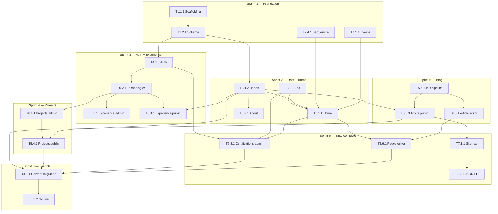

# Implementation Plan — Portafolio Profesional & Marca Personal

## Esteban Maya | Software Engineer


| Campo                       | Valor                                                                                                                              |
| --------------------------- | ---------------------------------------------------------------------------------------------------------------------------------- |
| **Versión**                 | 1.0                                                                                                                                |
| **Fecha**                   | 18 de junio de 2026                                                                                                                |
| **Autor**                   | Staff Engineer                                                                                                                     |
| **Estado**                  | Ready for Execution                                                                                                                |
| **Documentos relacionados** | [PRD.md](../product/PRD.md), [Architecture.md](../architecture/Architecture.md), [TechnicalDesign.md](../engineering/TechnicalDesign.md), [UXDesign.md](../ux/UXDesign.md) |


---

## Tabla de contenidos

1. [Resumen ejecutivo](#1-resumen-ejecutivo)
2. [Principios de ordenamiento](#2-principios-de-ordenamiento)
3. [Cronograma por sprint](#3-cronograma-por-sprint)
4. [Epics](#4-epics)
5. [Resumen de estimaciones](#5-resumen-de-estimaciones)
6. [Grafo de dependencias críticas](#6-grafo-de-dependencias-críticas)
7. [Definition of Done](#7-definition-of-done)
8. [Riesgos de implementación](#8-riesgos-de-implementación)

---

## 1. Resumen ejecutivo

### 1.1 Objetivo

Entregar el **MVP production-ready** en **8 sprints** (8 semanas), 1 desarrollador, siguiendo el orden que minimiza retrabajo: **infra → schema → design system → domain layer → auth → catálogo shared → entidades → SEO → contenido → launch**.

### 1.2 Convenciones


| Campo          | Significado                                                              |
| -------------- | ------------------------------------------------------------------------ |
| **Estimación** | Días-persona (`d`); ~4–5 h focus/día; 1 dev                              |
| **Prioridad**  | P0 = blocker · P1 = MVP required · P2 = MVP nice-to-have · P3 = post-MVP |
| **Sprint**     | S1–S8 (1 semana c/u)                                                     |
| **IDs**        | `E` = Epic · `F` = Feature · `T` = Task · `ST` = Subtask                 |


### 1.3 Totales MVP


| Métrica          | Valor                       |
| ---------------- | --------------------------- |
| Epics            | 8                           |
| Features         | 32                          |
| Tasks            | 78                          |
| Estimación total | ~~38 días (~~8 semanas)     |
| Buffer incluido  | ~2 d en S8 para imprevistos |


---

## 2. Principios de ordenamiento

Orden elegido para **evitar retrabajo**:


| #   | Principio                                      | Por qué                                                      |
| --- | ---------------------------------------------- | ------------------------------------------------------------ |
| 1   | **Schema DB antes que UI**                     | Evita mock data throwaway y migraciones retroactivas         |
| 2   | **Design tokens antes que páginas**            | Un solo pase visual; no refactor CSS por página              |
| 3   | **SeoService en S1, no S6**                    | PRD: "SEO tardío" es riesgo; metadata desde el primer layout |
| 4   | **Technologies antes que Experience/Projects** | M:N relations; picker admin reutilizable                     |
| 5   | **Repository layer antes que admin y public**  | Una sola fuente de queries; no duplicar Supabase calls       |
| 6   | **Auth antes de admin CRUD en staging**        | No re-securizar actions después                              |
| 7   | **Public read paths antes que admin write**    | Validar rendering con seed data; admin alimenta lo existente |
| 8   | **Markdown pipeline una vez, reutilizar**      | Blog preview admin = blog public render                      |
| 9   | **Contenido real al final**                    | CMS funcional antes de migrar; evita editar dos veces        |
| 10  | **CI desde S1**                                | No acumular deuda de calidad en S8                           |


---

## 3. Cronograma por sprint

```
S1          S2          S3          S4          S5          S6          S7          S8
│           │           │           │           │           │           │           │
├─ E1 Foundation ──────┤           │           │           │           │           │
├─ E2 Design Shell ────┼───────────┤           │           │           │           │
├─ E3 Data Layer ──────┼───────────┼───────────┤           │           │           │
│           ├─ E5 Home/About ──────┤           │           │           │           │
│           │           ├─ E4 Auth ┤           │           │           │           │
│           │           ├─ E5 Exp ─┼─ E6 Exp ──┤           │           │           │
│           │           │           ├─ E5 Proj ─┼─ E6 Proj ─┤           │           │
│           │           │           │           ├─ E5 Blog ─┼─ E6 Art ──┤           │
│           │           │           │           │           ├─ E7 SEO ──┼─ E6 Pages ─┤
│           │           │           │           │           │           ├─ Polish ────┤
│           │           │           │           │           │           │           ├─ E8 Launch
```


| Sprint | Epics activos  | Entregable demo-able                        |
| ------ | -------------- | ------------------------------------------- |
| **S1** | E1, E2         | App corre local; layouts + tokens; CI green |
| **S2** | E3, E5         | Home + About renderizan desde DB seed       |
| **S3** | E3, E4, E5, E6 | Experience + Tech CRUD admin; auth login    |
| **S4** | E5, E6         | Projects public + admin CRUD                |
| **S5** | E5, E6         | Blog list/detail + article editor publish   |
| **S6** | E6, E7         | SEO completo; pages editor; certifications CRUD; sitemap live    |
| **S7** | E4, E2, E6     | Auth hardened; a11y; admin dashboard        |
| **S8** | E8             | Contenido real; QA; production launch       |


---

## 4. Epics

---

### E1 — Foundation & Infrastructure

**Descripción:** Repositorio, entornos, base de datos, CI/CD y contratos base sobre los que se construye todo lo demás.
**Sprint:** S1 · **Estimación total:** 4.5 d · **Prioridad:** P0

---

#### F1.1 — Project Scaffolding


| Campo          | Valor |
| -------------- | ----- |
| **Sprint**     | S1    |
| **Estimación** | 1 d   |
| **Prioridad**  | P0    |


##### T1.1.1 — Inicializar monorepo Next.js


| Campo            | Valor                                                                                                                                                      |
| ---------------- | ---------------------------------------------------------------------------------------------------------------------------------------------------------- |
| **Descripción**  | Crear app con `create-next-app` (TS, Tailwind, App Router, ESLint). Configurar `tsconfig strict`, path alias `@/`, `.nvmrc` Node 22, `.env.local.example`. |
| **Dependencias** | —                                                                                                                                                          |
| **Estimación**   | 0.25 d                                                                                                                                                     |
| **Prioridad**    | P0                                                                                                                                                         |


| ID        | Subtask                                                              |
| --------- | -------------------------------------------------------------------- |
| ST1.1.1.1 | Ejecutar `create-next-app` con opciones definidas en TechnicalDesign |
| ST1.1.1.2 | Configurar `tsconfig.json`: strict, noUncheckedIndexedAccess, paths  |
| ST1.1.1.3 | Crear `.env.local.example` con variables documentadas                |
| ST1.1.1.4 | Añadir scripts npm: dev, build, lint, typecheck, test                |


##### T1.1.2 — Configurar CI GitHub Actions


| Campo            | Valor                                                                                  |
| ---------------- | -------------------------------------------------------------------------------------- |
| **Descripción**  | Workflow `ci.yml`: checkout, npm ci, lint, typecheck, test, build en PR y push a main. |
| **Dependencias** | T1.1.1                                                                                 |
| **Estimación**   | 0.25 d                                                                                 |
| **Prioridad**    | P0                                                                                     |


| ID        | Subtask                                |
| --------- | -------------------------------------- |
| ST1.1.2.1 | Crear `.github/workflows/ci.yml`       |
| ST1.1.2.2 | Verificar pipeline green en PR inicial |


##### T1.1.3 — Conectar Vercel + GitHub


| Campo            | Valor                                                                            |
| ---------------- | -------------------------------------------------------------------------------- |
| **Descripción**  | Proyecto Vercel linked al repo. Preview deploys en PR. Production en merge main. |
| **Dependencias** | T1.1.2                                                                           |
| **Estimación**   | 0.25 d                                                                           |
| **Prioridad**    | P0                                                                               |


| ID        | Subtask                                  |
| --------- | ---------------------------------------- |
| ST1.1.3.1 | Import repo en Vercel                    |
| ST1.1.3.2 | Configurar env vars vacías (placeholder) |
| ST1.1.3.3 | Verificar preview deploy exitoso         |


##### T1.1.4 — Configurar Supabase projects


| Campo            | Valor                                                                                 |
| ---------------- | ------------------------------------------------------------------------------------- |
| **Descripción**  | Crear proyectos Supabase staging + prod. Instalar Supabase CLI. Link local a staging. |
| **Dependencias** | —                                                                                     |
| **Estimación**   | 0.25 d                                                                                |
| **Prioridad**    | P0                                                                                    |


| ID        | Subtask                                                  |
| --------- | -------------------------------------------------------- |
| ST1.1.4.1 | Crear `portfolio-staging` y `portfolio-prod` en Supabase |
| ST1.1.4.2 | Instalar CLI; `supabase init`; link staging              |
| ST1.1.4.3 | Configurar env vars Supabase en Vercel (staging/prod)    |


---

#### F1.2 — Database Schema & RLS


| Campo          | Valor |
| -------------- | ----- |
| **Sprint**     | S1    |
| **Estimación** | 2 d   |
| **Prioridad**  | P0    |


##### T1.2.1 — Migración schema inicial


| Campo            | Valor                                                                                                                                                                                                    |
| ---------------- | -------------------------------------------------------------------------------------------------------------------------------------------------------------------------------------------------------- |
| **Descripción**  | SQL migration `001_initial_schema.sql`: enums, tablas (technologies, projects, articles, experiences, junctions, page_content, seo_settings, admin_users, media_assets), indexes, triggers `updated_at`. |
| **Dependencias** | T1.1.4                                                                                                                                                                                                   |
| **Estimación**   | 1 d                                                                                                                                                                                                      |
| **Prioridad**    | P0                                                                                                                                                                                                       |


| ID        | Subtask                                       |
| --------- | --------------------------------------------- |
| ST1.2.1.1 | Crear enums `content_status`, `tech_category` |
| ST1.2.1.2 | Crear tablas core + FK + indexes              |
| ST1.2.1.3 | Trigger `updated_at` en tablas mutables       |
| ST1.2.1.4 | `supabase db push` staging; verificar schema  |


##### T1.2.2 — Row Level Security policies


| Campo            | Valor                                                                            |
| ---------------- | -------------------------------------------------------------------------------- |
| **Descripción**  | RLS: public SELECT published/draft rules; admin ALL via `admin_users` whitelist. |
| **Dependencias** | T1.2.1                                                                           |
| **Estimación**   | 0.5 d                                                                            |
| **Prioridad**    | P0                                                                               |


| ID        | Subtask                                                     |
| --------- | ----------------------------------------------------------- |
| ST1.2.2.1 | Enable RLS on all content tables                            |
| ST1.2.2.2 | Policies public read (published only for projects/articles) |
| ST1.2.2.3 | Policies admin write (auth.uid in admin_users)              |
| ST1.2.2.4 | Test policies con anon key vs service role                  |


##### T1.2.3 — Seed data dev/staging


| Campo            | Valor                                                                                               |
| ---------------- | --------------------------------------------------------------------------------------------------- |
| **Descripción**  | `supabase/seed.sql` con datos de IDEA.html (placeholder estructurado) para desarrollo. **No prod.** |
| **Dependencias** | T1.2.2                                                                                              |
| **Estimación**   | 0.5 d                                                                                               |
| **Prioridad**    | P1                                                                                                  |


| ID        | Subtask                                             |
| --------- | --------------------------------------------------- |
| ST1.2.3.1 | Seed seo_settings singleton                         |
| ST1.2.3.2 | Seed page_content (hero, about, contact)            |
| ST1.2.3.3 | Seed technologies, experiences, projects, 1 article |
| ST1.2.3.4 | Documentar `npm run db:seed`                        |


---

#### F1.3 — Supabase Client Setup


| Campo          | Valor |
| -------------- | ----- |
| **Sprint**     | S1    |
| **Estimación** | 1 d   |
| **Prioridad**  | P0    |


##### T1.3.1 — Clientes Supabase SSR


| Campo            | Valor                                                                                        |
| ---------------- | -------------------------------------------------------------------------------------------- |
| **Descripción**  | Implementar `lib/supabase/server.ts`, `client.ts`, `middleware.ts` según guía @supabase/ssr. |
| **Dependencias** | T1.1.4, T1.2.1                                                                               |
| **Estimación**   | 0.5 d                                                                                        |
| **Prioridad**    | P0                                                                                           |


| ID        | Subtask                           |
| --------- | --------------------------------- |
| ST1.3.1.1 | Server client con cookies get/set |
| ST1.3.1.2 | Browser client                    |
| ST1.3.1.3 | Middleware helper session refresh |


##### T1.3.2 — Generar tipos TypeScript DB


| Campo            | Valor                                                                             |
| ---------------- | --------------------------------------------------------------------------------- |
| **Descripción**  | `supabase gen types typescript` → `types/database.ts`. Script `npm run db:types`. |
| **Dependencias** | T1.2.1                                                                            |
| **Estimación**   | 0.25 d                                                                            |
| **Prioridad**    | P0                                                                                |


| ID        | Subtask                                     |
| --------- | ------------------------------------------- |
| ST1.3.2.1 | Generar types desde staging                 |
| ST1.3.2.2 | Export Database type en `types/database.ts` |


##### T1.3.3 — Supabase Storage buckets


| Campo            | Valor                                                                             |
| ---------------- | --------------------------------------------------------------------------------- |
| **Descripción**  | Buckets `media/` (public read) y `cv/` (public read). Policies upload admin-only. |
| **Dependencias** | T1.2.2                                                                            |
| **Estimación**   | 0.25 d                                                                            |
| **Prioridad**    | P1                                                                                |


| ID        | Subtask                               |
| --------- | ------------------------------------- |
| ST1.3.3.1 | Crear buckets en Supabase dashboard   |
| ST1.3.3.2 | Storage RLS: public read, admin write |


---

### E2 — Design System & Public Shell

**Descripción:** Tokens visuales IDEA.html, componentes base, layouts públicos, routing skeleton, metadata defaults.
**Sprint:** S1–S2 (shell), S7 (polish) · **Estimación total:** 5 d · **Prioridad:** P0

---

#### F2.1 — Design Tokens & Tailwind


| Campo          | Valor |
| -------------- | ----- |
| **Sprint**     | S1    |
| **Estimación** | 1 d   |
| **Prioridad**  | P0    |


##### T2.1.1 — Configurar Tailwind 4 + tokens


| Campo            | Valor                                                                                        |
| ---------------- | -------------------------------------------------------------------------------------------- |
| **Descripción**  | `@theme` en `globals.css` con tokens IDEA.html (colors, fonts, spacing). Dark class en html. |
| **Dependencias** | T1.1.1                                                                                       |
| **Estimación**   | 0.5 d                                                                                        |
| **Prioridad**    | P0                                                                                           |


| ID        | Subtask                                   |
| --------- | ----------------------------------------- |
| ST2.1.1.1 | Migrar color tokens de IDEA.html          |
| ST2.1.1.2 | Configurar Inter + Geist via next/font    |
| ST2.1.1.3 | `@tailwindcss/typography` para prose blog |


##### T2.1.2 — Utilidades CSS compartidas


| Campo            | Valor                                                                           |
| ---------------- | ------------------------------------------------------------------------------- |
| **Descripción**  | Clases: sr-only, focus-visible, reduced-motion, section-label, nav-link states. |
| **Dependencias** | T2.1.1                                                                          |
| **Estimación**   | 0.5 d                                                                           |
| **Prioridad**    | P0                                                                              |


| ID        | Subtask                                   |
| --------- | ----------------------------------------- |
| ST2.1.2.1 | Port CSS utilities de IDEA.html           |
| ST2.1.2.2 | Verificar contraste WCAG AA en text pairs |


---

#### F2.2 — Public UI Components


| Campo          | Valor |
| -------------- | ----- |
| **Sprint**     | S1    |
| **Estimación** | 1.5 d |
| **Prioridad**  | P0    |


##### T2.2.1 — Componentes primitivos public


| Campo            | Valor                                                                                      |
| ---------------- | ------------------------------------------------------------------------------------------ |
| **Descripción**  | Server Components: Card, Badge, Button (primary/secondary), SectionLabel, MetricHighlight. |
| **Dependencias** | T2.1.1                                                                                     |
| **Estimación**   | 0.75 d                                                                                     |
| **Prioridad**    | P0                                                                                         |


| ID        | Subtask                                       |
| --------- | --------------------------------------------- |
| ST2.2.1.1 | Card + Badge                                  |
| ST2.2.1.2 | Button variants (min-height 44px)             |
| ST2.2.1.3 | MetricHighlight + metric grid                 |
| ST2.2.1.4 | Storybook optional / visual check en dev page |


##### T2.2.2 — Header + Footer + MobileNav


| Campo            | Valor                                                                                                                                |
| ---------------- | ------------------------------------------------------------------------------------------------------------------------------------ |
| **Descripción**  | Header sticky, nav 6 links, CTA Contact, social icons. Footer copyright + links. MobileNav client component con trap focus + Escape. |
| **Dependencias** | T2.2.1                                                                                                                               |
| **Estimación**   | 0.75 d                                                                                                                               |
| **Prioridad**    | P0                                                                                                                                   |


| ID        | Subtask                                     |
| --------- | ------------------------------------------- |
| ST2.2.2.1 | Header desktop (Server Component)           |
| ST2.2.2.2 | MobileNav client (hamburger, aria-expanded) |
| ST2.2.2.3 | Footer                                      |
| ST2.2.2.4 | Skip link "Saltar al contenido"             |


---

#### F2.3 — Layouts & Routing Skeleton


| Campo          | Valor |
| -------------- | ----- |
| **Sprint**     | S1    |
| **Estimación** | 0.5 d |
| **Prioridad**  | P0    |


##### T2.3.1 — Route groups y placeholder pages


| Campo            | Valor                                                                                                                                            |
| ---------------- | ------------------------------------------------------------------------------------------------------------------------------------------------ |
| **Descripción**  | `app/(public)/layout.tsx` + placeholder pages para /, /about, /experience, /projects, /blog, /contact. Root layout con fonts + default metadata. |
| **Dependencias** | T2.2.2                                                                                                                                           |
| **Estimación**   | 0.5 d                                                                                                                                            |
| **Prioridad**    | P0                                                                                                                                               |


| ID        | Subtask                                |
| --------- | -------------------------------------- |
| ST2.3.1.1 | Root layout + metadata defaults        |
| ST2.3.1.2 | Public layout con Header/Footer        |
| ST2.3.1.3 | Placeholder pages (h1 + "coming soon") |
| ST2.3.1.4 | 404.tsx + error.tsx                    |


---

#### F2.4 — Metadata Foundation (early SEO)


| Campo          | Valor |
| -------------- | ----- |
| **Sprint**     | S1    |
| **Estimación** | 1 d   |
| **Prioridad**  | P0    |


##### T2.4.1 — SeoService skeleton


| Campo            | Valor                                                                                                     |
| ---------------- | --------------------------------------------------------------------------------------------------------- |
| **Descripción**  | `lib/domain/seo/seo-service.ts`: resolvePageMeta, title template, defaults. Usado desde día 1 en layouts. |
| **Dependencias** | T1.3.1                                                                                                    |
| **Estimación**   | 0.5 d                                                                                                     |
| **Prioridad**    | P0                                                                                                        |


| ID        | Subtask                           |
| --------- | --------------------------------- |
| ST2.4.1.1 | SeoFields type + ResolvedSeo type |
| ST2.4.1.2 | resolvePageMeta merge logic       |
| ST2.4.1.3 | Unit tests merge rules            |


##### T2.4.2 — generateMetadata en root + placeholders


| Campo            | Valor                                                                               |
| ---------------- | ----------------------------------------------------------------------------------- |
| **Descripción**  | Wire generateMetadata en root layout y placeholder pages leyendo seo_settings seed. |
| **Dependencias** | T2.4.1, T1.2.3                                                                      |
| **Estimación**   | 0.5 d                                                                               |
| **Prioridad**    | P0                                                                                  |


| ID        | Subtask                                    |
| --------- | ------------------------------------------ |
| ST2.4.2.1 | seoRepo.getSettings()                      |
| ST2.4.2.2 | generateMetadata root layout               |
| ST2.4.2.3 | Verificar title/description en HTML source |


---

#### F2.5 — Responsive & A11y Polish


| Campo          | Valor |
| -------------- | ----- |
| **Sprint**     | S7    |
| **Estimación** | 1 d   |
| **Prioridad**  | P1    |


##### T2.5.1 — Audit accesibilidad


| Campo            | Valor                                                                                          |
| ---------------- | ---------------------------------------------------------------------------------------------- |
| **Descripción**  | Keyboard nav, screen reader landmarks, contrast, touch targets. Fix issues UXDesign checklist. |
| **Dependencias** | E5 complete                                                                                    |
| **Estimación**   | 0.5 d                                                                                          |
| **Prioridad**    | P1                                                                                             |


| ID        | Subtask                             |
| --------- | ----------------------------------- |
| ST2.5.1.1 | axe DevTools scan all public routes |
| ST2.5.1.2 | Keyboard-only walkthrough           |
| ST2.5.1.3 | Fix critical a11y issues            |


##### T2.5.2 — Mobile layout fixes


| Campo            | Valor                                                                        |
| ---------------- | ---------------------------------------------------------------------------- |
| **Descripción**  | Home mobile: metrics before photo (UX-R04). Bio-bridge table stack (UX-R17). |
| **Dependencias** | T5.1.1, T5.2.1                                                               |
| **Estimación**   | 0.5 d                                                                        |
| **Prioridad**    | P1                                                                           |


| ID        | Subtask                       |
| --------- | ----------------------------- |
| ST2.5.2.1 | Reorder Home mobile sections  |
| ST2.5.2.2 | Bio-bridge responsive cards   |
| ST2.5.2.3 | Test 375px viewport all pages |


---

### E3 — Data Layer & Domain Services

**Descripción:** Repositories, Zod schemas, domain services, cache tags, revalidation — capa compartida public + admin.
**Sprint:** S2–S3 · **Estimación total:** 4 d · **Prioridad:** P0

---

#### F3.1 — Repository Layer


| Campo          | Valor |
| -------------- | ----- |
| **Sprint**     | S2    |
| **Estimación** | 1.5 d |
| **Prioridad**  | P0    |


##### T3.1.1 — Base repository + error handling


| Campo            | Valor                                                                                          |
| ---------------- | ---------------------------------------------------------------------------------------------- |
| **Descripción**  | Patrón repo con Supabase server client. Error mapping, typed returns, React `cache()` wrapper. |
| **Dependencias** | T1.3.1, T1.3.2                                                                                 |
| **Estimación**   | 0.5 d                                                                                          |
| **Prioridad**    | P0                                                                                             |


| ID        | Subtask                                  |
| --------- | ---------------------------------------- |
| ST3.1.1.1 | `lib/repositories/base.ts` error helpers |
| ST3.1.1.2 | React cache() pattern documentado        |


##### T3.1.2 — Content repositories


| Campo            | Valor                                                                                                                |
| ---------------- | -------------------------------------------------------------------------------------------------------------------- |
| **Descripción**  | Repos: seo, page-content, technology, experience, project, article, media. Queries public (published) + admin (all). |
| **Dependencias** | T3.1.1                                                                                                               |
| **Estimación**   | 1 d                                                                                                                  |
| **Prioridad**    | P0                                                                                                                   |


| ID        | Subtask                                |
| --------- | -------------------------------------- |
| ST3.1.2.1 | seoRepo + pageContentRepo              |
| ST3.1.2.2 | technologyRepo                         |
| ST3.1.2.3 | experienceRepo (with tech join)        |
| ST3.1.2.4 | projectRepo (with tech join, featured) |
| ST3.1.2.5 | articleRepo (paginated, by slug)       |


---

#### F3.2 — Zod Schemas


| Campo          | Valor |
| -------------- | ----- |
| **Sprint**     | S2    |
| **Estimación** | 1 d   |
| **Prioridad**  | P0    |


##### T3.2.1 — Entity validation schemas


| Campo            | Valor                                                                                                              |
| ---------------- | ------------------------------------------------------------------------------------------------------------------ |
| **Descripción**  | Zod schemas: Project, Article, Experience, Technology, PageContent (hero/about/contact), SeoSettings. Infer types. |
| **Dependencias** | T1.2.1                                                                                                             |
| **Estimación**   | 1 d                                                                                                                |
| **Prioridad**    | P0                                                                                                                 |


| ID        | Subtask                                        |
| --------- | ---------------------------------------------- |
| ST3.2.1.1 | technologySchema, experienceSchema             |
| ST3.2.1.2 | projectSchema, articleSchema (excerpt 160-320) |
| ST3.2.1.3 | pageContentSchemas (hero, about, contact)      |
| ST3.2.1.4 | seoSettingsSchema                              |


---

#### F3.3 — Domain Services


| Campo          | Valor |
| -------------- | ----- |
| **Sprint**     | S2–S3 |
| **Estimación** | 1.5 d |
| **Prioridad**  | P0    |


##### T3.3.1 — ContentService


| Campo            | Valor                                                                                |
| ---------------- | ------------------------------------------------------------------------------------ |
| **Descripción**  | publishArticle, publishProject, generateSlug (collision suffix), computeReadingTime. |
| **Dependencias** | T3.1.2, T3.2.1                                                                       |
| **Estimación**   | 0.75 d                                                                               |
| **Prioridad**    | P0                                                                                   |


| ID        | Subtask                                 |
| --------- | --------------------------------------- |
| ST3.3.1.1 | slug generation + uniqueness check      |
| ST3.3.1.2 | publish flows (set publishedAt, status) |
| ST3.3.1.3 | readingTime calculator                  |
| ST3.3.1.4 | Unit tests domain rules                 |


##### T3.3.2 — Revalidation helper


| Campo            | Valor                                                                         |
| ---------------- | ----------------------------------------------------------------------------- |
| **Descripción**  | `lib/revalidate.ts`: map entity → tags; call revalidateTag bundle on publish. |
| **Dependencias** | T3.3.1                                                                        |
| **Estimación**   | 0.25 d                                                                        |
| **Prioridad**    | P0                                                                            |


| ID        | Subtask                                  |
| --------- | ---------------------------------------- |
| ST3.3.2.1 | Tag constants + revalidateEntity()       |
| ST3.3.2.2 | Wire en publish actions (stub initially) |


##### T3.3.3 — MediaService


| Campo            | Valor                                                                    |
| ---------------- | ------------------------------------------------------------------------ |
| **Descripción**  | Upload to Supabase Storage, MIME validation, max 5MB, return public URL. |
| **Dependencias** | T1.3.3                                                                   |
| **Estimación**   | 0.5 d                                                                    |
| **Prioridad**    | P1                                                                       |


| ID        | Subtask                      |
| --------- | ---------------------------- |
| ST3.3.3.1 | uploadImage() con validation |
| ST3.3.3.2 | uploadPdf() para CV          |
| ST3.3.3.3 | media_assets table insert    |


---

### E4 — Authentication & Security

**Descripción:** OAuth GitHub, middleware guards, admin whitelist, protección Server Actions.
**Sprint:** S3 (login), S7 (hardening) · **Estimación total:** 2.5 d · **Prioridad:** P0

---

#### F4.1 — Supabase Auth OAuth


| Campo          | Valor |
| -------------- | ----- |
| **Sprint**     | S3    |
| **Estimación** | 1.5 d |
| **Prioridad**  | P0    |


##### T4.1.1 — GitHub OAuth provider


| Campo            | Valor                                                                            |
| ---------------- | -------------------------------------------------------------------------------- |
| **Descripción**  | Configurar GitHub OAuth app + Supabase Auth provider. Callback URL staging/prod. |
| **Dependencias** | T1.1.4                                                                           |
| **Estimación**   | 0.25 d                                                                           |
| **Prioridad**    | P0                                                                               |


| ID        | Subtask                       |
| --------- | ----------------------------- |
| ST4.1.1.1 | GitHub OAuth app create       |
| ST4.1.1.2 | Supabase Auth provider config |
| ST4.1.1.3 | Callback URLs per environment |


##### T4.1.2 — Login page + OAuth flow


| Campo            | Valor                                                                           |
| ---------------- | ------------------------------------------------------------------------------- |
| **Descripción**  | `/admin/login` con botón "Login with GitHub". Redirect post-auth. Error states. |
| **Dependencias** | T4.1.1, T2.3.1                                                                  |
| **Estimación**   | 0.5 d                                                                           |
| **Prioridad**    | P0                                                                              |


| ID        | Subtask                       |
| --------- | ----------------------------- |
| ST4.1.2.1 | Login page UI (minimal, dark) |
| ST4.1.2.2 | signInWithOAuth action        |
| ST4.1.2.3 | Error message unauthorized    |


##### T4.1.3 — Middleware auth guard


| Campo            | Valor                                                                                                    |
| ---------------- | -------------------------------------------------------------------------------------------------------- |
| **Descripción**  | `middleware.ts`: session refresh, /admin/* guard, login redirect loop prevention, X-Robots-Tag non-prod. |
| **Dependencias** | T1.3.1, T4.1.2                                                                                           |
| **Estimación**   | 0.5 d                                                                                                    |
| **Prioridad**    | P0                                                                                                       |


| ID        | Subtask                                 |
| --------- | --------------------------------------- |
| ST4.1.3.1 | Session refresh en middleware           |
| ST4.1.3.2 | Redirect unauthenticated → /admin/login |
| ST4.1.3.3 | noindex header preview environments     |


##### T4.1.4 — requireAdmin + whitelist


| Campo            | Valor                                                                                       |
| ---------------- | ------------------------------------------------------------------------------------------- |
| **Descripción**  | `lib/auth/require-admin.ts`: check session + admin_users table. signOut if not whitelisted. |
| **Dependencias** | T4.1.3, T1.2.1                                                                              |
| **Estimación**   | 0.25 d                                                                                      |
| **Prioridad**    | P0                                                                                          |


| ID        | Subtask                        |
| --------- | ------------------------------ |
| ST4.1.4.1 | requireAdmin() helper          |
| ST4.1.4.2 | Seed admin UUID en admin_users |
| ST4.1.4.3 | Use in all Server Actions      |


---

#### F4.2 — Security Hardening


| Campo          | Valor |
| -------------- | ----- |
| **Sprint**     | S7    |
| **Estimación** | 1 d   |
| **Prioridad**  | P1    |


##### T4.2.1 — Server Action auth audit


| Campo            | Valor                                                                      |
| ---------------- | -------------------------------------------------------------------------- |
| **Descripción**  | Verificar requireAdmin() en 100% mutations. Rate limit login via Supabase. |
| **Dependencias** | E6 complete                                                                |
| **Estimación**   | 0.5 d                                                                      |
| **Prioridad**    | P1                                                                         |


| ID        | Subtask                              |
| --------- | ------------------------------------ |
| ST4.2.1.1 | Audit checklist all actions.ts       |
| ST4.2.1.2 | Test unauthorized POST returns error |


##### T4.2.2 — Security headers


| Campo            | Valor                                                                                      |
| ---------------- | ------------------------------------------------------------------------------------------ |
| **Descripción**  | next.config headers: X-Frame-Options, Referrer-Policy, Permissions-Policy. CSP basic (P2). |
| **Dependencias** | T1.1.3                                                                                     |
| **Estimación**   | 0.5 d                                                                                      |
| **Prioridad**    | P2                                                                                         |


| ID        | Subtask                             |
| --------- | ----------------------------------- |
| ST4.2.2.1 | Security headers en next.config.ts  |
| ST4.2.2.2 | Verify headers en production deploy |


---

### E5 — Public Front Office

**Descripción:** Páginas públicas SSG/ISR consumiendo repositories.
**Sprint:** S2–S5 · **Estimación total:** 9 d · **Prioridad:** P0

---

#### F5.1 — Home Page


| Campo          | Valor |
| -------------- | ----- |
| **Sprint**     | S2    |
| **Estimación** | 1.5 d |
| **Prioridad**  | P0    |


##### T5.1.1 — HeroSection + ImpactMetrics


| Campo            | Valor                                                                                                   |
| ---------------- | ------------------------------------------------------------------------------------------------------- |
| **Descripción**  | Home `/`: hero desde page_content, metrics cards, availability badge, photo, CTAs. ISR revalidate 3600. |
| **Dependencias** | T3.1.2, T2.2.1, T2.4.1                                                                                  |
| **Estimación**   | 1 d                                                                                                     |
| **Prioridad**    | P0                                                                                                      |


| ID        | Subtask                                   |
| --------- | ----------------------------------------- |
| ST5.1.1.1 | HeroSection Server Component              |
| ST5.1.1.2 | ImpactMetrics grid                        |
| ST5.1.1.3 | CV + social links (disabled if URL empty) |
| ST5.1.1.4 | generateMetadata home                     |


##### T5.1.2 — Home teasers


| Campo            | Valor                                                                           |
| ---------------- | ------------------------------------------------------------------------------- |
| **Descripción**  | Featured projects (max 3) + latest articles (max 3) sections con "Ver todos →". |
| **Dependencias** | T5.1.1, T3.1.2                                                                  |
| **Estimación**   | 0.5 d                                                                           |
| **Prioridad**    | P0                                                                              |


| ID        | Subtask                        |
| --------- | ------------------------------ |
| ST5.1.2.1 | FeaturedProjects section       |
| ST5.1.2.2 | LatestArticles section         |
| ST5.1.2.3 | Empty states si no hay content |


---

#### F5.2 — About Page


| Campo          | Valor |
| -------------- | ----- |
| **Sprint**     | S2    |
| **Estimación** | 1 d   |
| **Prioridad**  | P0    |


##### T5.2.1 — About + BioBridge


| Campo            | Valor                                                                             |
| ---------------- | --------------------------------------------------------------------------------- |
| **Descripción**  | `/about`: biografía, intereses badges, BioBridgeTable responsive. JSON-LD Person. |
| **Dependencias** | T3.1.2, T2.2.1                                                                    |
| **Estimación**   | 1 d                                                                               |
| **Prioridad**    | P0                                                                                |


| ID        | Subtask                                       |
| --------- | --------------------------------------------- |
| ST5.2.1.1 | About prose section                           |
| ST5.2.1.2 | BioBridgeTable (desktop table / mobile cards) |
| ST5.2.1.3 | Interests badges                              |
| ST5.2.1.4 | JsonLd Person component                       |


---

#### F5.3 — Experience Page


| Campo          | Valor |
| -------------- | ----- |
| **Sprint**     | S3    |
| **Estimación** | 1 d   |
| **Prioridad**  | P0    |


##### T5.3.1 — ExperienceTimeline


| Campo            | Valor                                                                                                             |
| ---------------- | ----------------------------------------------------------------------------------------------------------------- |
| **Descripción**  | `/experience`: timeline vertical, cards por entry, bullets, tech badges, "Presente" si end_date null. CTA footer. |
| **Dependencias** | T3.1.2, T3.3.0 (tech exists)                                                                                      |
| **Estimación**   | 1 d                                                                                                               |
| **Prioridad**    | P0                                                                                                                |


| ID        | Subtask                             |
| --------- | ----------------------------------- |
| ST5.3.1.1 | ExperienceTimeline Server Component |
| ST5.3.1.2 | ExperienceCard subcomponent         |
| ST5.3.1.3 | CTA section (Contact + Projects)    |
| ST5.3.1.4 | ISR tag `experience`                |


---

#### F5.4 — Projects Page


| Campo          | Valor |
| -------------- | ----- |
| **Sprint**     | S4    |
| **Estimación** | 1.5 d |
| **Prioridad**  | P0    |


##### T5.4.1 — ProjectGrid + ProjectCard


| Campo            | Valor                                                                                                                                    |
| ---------------- | ---------------------------------------------------------------------------------------------------------------------------------------- |
| **Descripción**  | `/projects`: grid responsive, ProjectCard con problema/solución/stack/resultado, GitHub/Demo links. Self-contained (no detail page MVP). |
| **Dependencias** | T3.1.2, T2.2.1                                                                                                                           |
| **Estimación**   | 1.5 d                                                                                                                                    |
| **Prioridad**    | P0                                                                                                                                       |


| ID        | Subtask                                        |
| --------- | ---------------------------------------------- |
| ST5.4.1.1 | ProjectCard Server Component (full case study) |
| ST5.4.1.2 | ProjectGrid layout (1/2 col)                   |
| ST5.4.1.3 | CTA footer                                     |
| ST5.4.1.4 | ISR tag `projects`                             |


---

#### F5.5 — Blog (The Lab)


| Campo          | Valor |
| -------------- | ----- |
| **Sprint**     | S5    |
| **Estimación** | 3 d   |
| **Prioridad**  | P0    |


##### T5.5.1 — Markdown render pipeline


| Campo            | Valor                                                                                                                            |
| ---------------- | -------------------------------------------------------------------------------------------------------------------------------- |
| **Descripción**  | `lib/markdown/render.ts`: react-markdown + remark-gfm + rehype-slug + rehype-pretty-code (Shiki). Shared public + admin preview. |
| **Dependencias** | T1.1.1                                                                                                                           |
| **Estimación**   | 1 d                                                                                                                              |
| **Prioridad**    | P0                                                                                                                               |


| ID        | Subtask                         |
| --------- | ------------------------------- |
| ST5.5.1.1 | Configure remark/rehype plugins |
| ST5.5.1.2 | Shiki theme matching dark site  |
| ST5.5.1.3 | Prose typography styles         |
| ST5.5.1.4 | Unit test render sample MD      |


##### T5.5.2 — Blog list page


| Campo            | Valor                                                                                                |
| ---------------- | ---------------------------------------------------------------------------------------------------- |
| **Descripción**  | `/blog`: grid ArticleCard, pagination (9/page), tag + date + reading time. Section header "The Lab". |
| **Dependencias** | T3.1.2, T2.2.1                                                                                       |
| **Estimación**   | 0.75 d                                                                                               |
| **Prioridad**    | P0                                                                                                   |


| ID        | Subtask                                    |
| --------- | ------------------------------------------ |
| ST5.5.2.1 | ArticleCard component                      |
| ST5.5.2.2 | Paginated list (searchParams or /page/[n]) |
| ST5.5.2.3 | Empty state                                |


##### T5.5.3 — Blog article page


| Campo            | Valor                                                                                                                   |
| ---------------- | ----------------------------------------------------------------------------------------------------------------------- |
| **Descripción**  | `/blog/[slug]`: full article, breadcrumbs, author box, soft CTA contact. generateStaticParams top N. notFound if draft. |
| **Dependencias** | T5.5.1, T5.5.2                                                                                                          |
| **Estimación**   | 1.25 d                                                                                                                  |
| **Prioridad**    | P0                                                                                                                      |


| ID        | Subtask                                 |
| --------- | --------------------------------------- |
| ST5.5.3.1 | Article page layout + metadata          |
| ST5.5.3.2 | Author box footer                       |
| ST5.5.3.3 | Breadcrumbs component                   |
| ST5.5.3.4 | JsonLd BlogPosting                      |
| ST5.5.3.5 | generateStaticParams + ISR tag per slug |


---

#### F5.6 — Contact Page


| Campo          | Valor |
| -------------- | ----- |
| **Sprint**     | S5    |
| **Estimación** | 0.5 d |
| **Prioridad**  | P0    |


##### T5.6.1 — ContactCTA page


| Campo            | Valor                                                                                 |
| ---------------- | ------------------------------------------------------------------------------------- |
| **Descripción**  | `/contact`: card centrada, email mailto, LinkedIn, GitHub desde page_content.contact. |
| **Dependencias** | T3.1.2, T2.2.1                                                                        |
| **Estimación**   | 0.5 d                                                                                 |
| **Prioridad**    | P0                                                                                    |


| ID        | Subtask                        |
| --------- | ------------------------------ |
| ST5.6.1.1 | Contact page from page_content |
| ST5.6.1.2 | CTA buttons con rel noopener   |


---

### E6 — Admin CMS

**Descripción:** Back office CRUD, forms, publish flows, page editors y gestión de certificaciones.
**Sprint:** S3–S7 · **Estimación total:** 12 d · **Prioridad:** P0

---

#### F6.1 — Admin Shell


| Campo          | Valor |
| -------------- | ----- |
| **Sprint**     | S3    |
| **Estimación** | 1 d   |
| **Prioridad**  | P0    |


##### T6.1.1 — Admin layout + navigation


| Campo            | Valor                                                                                                            |
| ---------------- | ---------------------------------------------------------------------------------------------------------------- |
| **Descripción**  | `/admin/layout.tsx`: sidebar nav (Dashboard, Projects, Articles, Experience, Tech, Certifications, Pages, SEO). shadcn/ui shell. |
| **Dependencias** | T4.1.3, shadcn init                                                                                              |
| **Estimación**   | 0.75 d                                                                                                           |
| **Prioridad**    | P0                                                                                                               |


| ID        | Subtask                              |
| --------- | ------------------------------------ |
| ST6.1.1.1 | `npx shadcn@latest init` themed dark |
| ST6.1.1.2 | AdminSidebar + AdminHeader           |
| ST6.1.1.3 | Logout action                        |


##### T6.1.2 — Admin dashboard


| Campo            | Valor                                                         |
| ---------------- | ------------------------------------------------------------- |
| **Descripción**  | `/admin`: counts drafts per entity, last edited, quick links. |
| **Dependencias** | T6.1.1, T3.1.2                                                |
| **Estimación**   | 0.25 d                                                        |
| **Prioridad**    | P2                                                            |


| ID        | Subtask               |
| --------- | --------------------- |
| ST6.1.2.1 | Dashboard stats cards |
| ST6.1.2.2 | Recent activity list  |


---

#### F6.2 — Technologies CRUD


| Campo          | Valor |
| -------------- | ----- |
| **Sprint**     | S3    |
| **Estimación** | 1 d   |
| **Prioridad**  | P0    |


##### T6.2.1 — Technologies admin


| Campo            | Valor                                                                                     |
| ---------------- | ----------------------------------------------------------------------------------------- |
| **Descripción**  | `/admin/technologies`: table list, create/edit dialog, category enum, delete con confirm. |
| **Dependencias** | T6.1.1, T3.1.2, T3.2.1, T4.1.4                                                            |
| **Estimación**   | 1 d                                                                                       |
| **Prioridad**    | P0                                                                                        |


| ID        | Subtask                           |
| --------- | --------------------------------- |
| ST6.2.1.1 | List table @tanstack/react-table  |
| ST6.2.1.2 | Create/Edit form + Server Actions |
| ST6.2.1.3 | Delete with confirmation dialog   |
| ST6.2.1.4 | revalidateTag on mutate           |


---

#### F6.3 — Experience CRUD


| Campo          | Valor |
| -------------- | ----- |
| **Sprint**     | S3    |
| **Estimación** | 1.5 d |
| **Prioridad**  | P0    |


##### T6.3.1 — Experience admin


| Campo            | Valor                                                                                                         |
| ---------------- | ------------------------------------------------------------------------------------------------------------- |
| **Descripción**  | `/admin/experience`: list ordered, edit form (company, role, dates, bullets dynamic array, TechnologyPicker). |
| **Dependencias** | T6.2.1, T3.3.1                                                                                                |
| **Estimación**   | 1.5 d                                                                                                         |
| **Prioridad**    | P0                                                                                                            |


| ID        | Subtask                          |
| --------- | -------------------------------- |
| ST6.3.1.1 | Experience list with sort_order  |
| ST6.3.1.2 | Form: bullets array (add/remove) |
| ST6.3.1.3 | TechnologyPicker multi-select    |
| ST6.3.1.4 | Server Actions CRUD + revalidate |


---

#### F6.4 — Projects CRUD


| Campo          | Valor |
| -------------- | ----- |
| **Sprint**     | S4    |
| **Estimación** | 2 d   |
| **Prioridad**  | P0    |


##### T6.4.1 — Projects admin


| Campo            | Valor                                                                                                                                |
| ---------------- | ------------------------------------------------------------------------------------------------------------------------------------ |
| **Descripción**  | `/admin/projects`: list con status badge, create/edit form (all fields + SEO panel + featured toggle + tech picker). Publish action. |
| **Dependencias** | T6.2.1, T6.3.1, T3.3.1                                                                                                               |
| **Estimación**   | 2 d                                                                                                                                  |
| **Prioridad**    | P0                                                                                                                                   |


| ID        | Subtask                              |
| --------- | ------------------------------------ |
| ST6.4.1.1 | Projects list table + status filters |
| ST6.4.1.2 | ProjectForm with all fields          |
| ST6.4.1.3 | SEO fields collapsible panel         |
| ST6.4.1.4 | Publish / unpublish actions          |
| ST6.4.1.5 | Featured toggle                      |


---

#### F6.5 — Articles CRUD


| Campo          | Valor |
| -------------- | ----- |
| **Sprint**     | S5    |
| **Estimación** | 2.5 d |
| **Prioridad**  | P0    |


##### T6.5.1 — Article editor


| Campo            | Valor                                                                                                                                                   |
| ---------------- | ------------------------------------------------------------------------------------------------------------------------------------------------------- |
| **Descripción**  | `/admin/articles/[id]`: title, slug auto, excerpt counter, tags, cover upload, MD textarea + live preview (shared render pipeline), SEO panel, publish. |
| **Dependencias** | T5.5.1, T3.3.3, T3.3.1                                                                                                                                  |
| **Estimación**   | 2.5 d                                                                                                                                                   |
| **Prioridad**    | P0                                                                                                                                                      |


| ID        | Subtask                              |
| --------- | ------------------------------------ |
| ST6.5.1.1 | Article list page                    |
| ST6.5.1.2 | MD editor + preview split pane       |
| ST6.5.1.3 | Cover image upload                   |
| ST6.5.1.4 | Excerpt char counter (160-320)       |
| ST6.5.1.5 | Publish flow + revalidate tags       |
| ST6.5.1.6 | E2E test: publish → visible on /blog |


---

#### F6.6 — Page Content Editor


| Campo          | Valor |
| -------------- | ----- |
| **Sprint**     | S6    |
| **Estimación** | 1.5 d |
| **Prioridad**  | P0    |


##### T6.6.1 — Pages admin (hero, about, contact)


| Campo            | Valor                                                                                                      |
| ---------------- | ---------------------------------------------------------------------------------------------------------- |
| **Descripción**  | `/admin/pages/[slug]`: forms específicos por page_content id. Hero metrics dynamic array. Bio-bridge rows. |
| **Dependencias** | T3.2.1, T6.1.1                                                                                             |
| **Estimación**   | 1.5 d                                                                                                      |
| **Prioridad**    | P0                                                                                                         |


| ID        | Subtask                                            |
| --------- | -------------------------------------------------- |
| ST6.6.1.1 | Hero editor (metrics, availability, photo URL, CV) |
| ST6.6.1.2 | About editor (paragraphs, interests, bioBridge)    |
| ST6.6.1.3 | Contact editor                                     |
| ST6.6.1.4 | Save + revalidate page-content + home              |


---

#### F6.7 — SEO Admin


| Campo          | Valor |
| -------------- | ----- |
| **Sprint**     | S6    |
| **Estimación** | 1 d   |
| **Prioridad**  | P0    |


##### T6.7.1 — Global SEO settings


| Campo            | Valor                                                                             |
| ---------------- | --------------------------------------------------------------------------------- |
| **Descripción**  | `/admin/seo`: edit seo_settings singleton. Preview snippet Google + OG card mock. |
| **Dependencias** | T2.4.1, T6.1.1                                                                    |
| **Estimación**   | 1 d                                                                               |
| **Prioridad**    | P0                                                                                |


| ID        | Subtask                   |
| --------- | ------------------------- |
| ST6.7.1.1 | SEO settings form         |
| ST6.7.1.2 | Snippet preview component |
| ST6.7.1.3 | OG card preview           |
| ST6.7.1.4 | revalidateTag `seo`       |


---

#### F6.8 — Certifications CRUD


| Campo          | Valor |
| -------------- | ----- |
| **Sprint**     | S6    |
| **Estimación** | 1 d   |
| **Prioridad**  | P0    |


##### T6.8.1 — Certifications admin


| Campo            | Valor                                                                                                                                                              |
| ---------------- | ------------------------------------------------------------------------------------------------------------------------------------------------------------------ |
| **Descripción**  | `/admin/certifications`: CRUD de ítems en `page_content` id `achievements` (por locale). Campos: título, meta, badge enum, URL opcional, orden. Editor de cabecera (label + title). |
| **Dependencias** | T6.1.1, T3.2.1, T5.1.1                                                                                                                                             |
| **Estimación**   | 1 d                                                                                                                                                                |
| **Prioridad**    | P0                                                                                                                                                                 |


| ID        | Subtask                                                       |
| --------- | ------------------------------------------------------------- |
| ST6.8.1.1 | List table ordenada por posición en `items`                   |
| ST6.8.1.2 | Create/Edit form (title, meta, badge, url) + Server Actions |
| ST6.8.1.3 | Section header editor (label, title del bloque)             |
| ST6.8.1.4 | Delete con confirmación                                       |
| ST6.8.1.5 | revalidateTag `page-content` + `home`                         |


---

### E7 — SEO & Discoverability

**Descripción:** Sitemap, robots, JSON-LD completo, analytics — completar SEO iniciado en S1.
**Sprint:** S6 · **Estimación total:** 2 d · **Prioridad:** P0

---

#### F7.1 — Sitemap & Robots


| Campo          | Valor  |
| -------------- | ------ |
| **Sprint**     | S6     |
| **Estimación** | 0.75 d |
| **Prioridad**  | P0     |


##### T7.1.1 — Dynamic sitemap


| Campo            | Valor                                                                                        |
| ---------------- | -------------------------------------------------------------------------------------------- |
| **Descripción**  | `app/sitemap.ts`: static routes + dynamic projects/articles published. Exclude drafts/admin. |
| **Dependencias** | T3.1.2, E5 complete                                                                          |
| **Estimación**   | 0.5 d                                                                                        |
| **Prioridad**    | P0                                                                                           |


| ID        | Subtask                          |
| --------- | -------------------------------- |
| ST7.1.1.1 | sitemap.ts implementation        |
| ST7.1.1.2 | Verify XML valid at /sitemap.xml |


##### T7.1.2 — robots.ts


| Campo            | Valor                                                           |
| ---------------- | --------------------------------------------------------------- |
| **Descripción**  | `app/robots.ts`: allow /, disallow /admin/, /api/. Sitemap URL. |
| **Dependencias** | T7.1.1                                                          |
| **Estimación**   | 0.25 d                                                          |
| **Prioridad**    | P0                                                              |


| ID        | Subtask              |
| --------- | -------------------- |
| ST7.1.2.1 | robots.ts            |
| ST7.1.2.2 | Verify en production |


---

#### F7.2 — Structured Data


| Campo          | Valor  |
| -------------- | ------ |
| **Sprint**     | S6     |
| **Estimación** | 0.75 d |
| **Prioridad**  | P0     |


##### T7.2.1 — JsonLd components


| Campo            | Valor                                                                                             |
| ---------------- | ------------------------------------------------------------------------------------------------- |
| **Descripción**  | `components/seo/JsonLd.tsx` + builders: Person, WebSite, BlogPosting, ProfilePage. Wire en pages. |
| **Dependencias** | T2.4.1, T5.2.1, T5.5.3                                                                            |
| **Estimación**   | 0.75 d                                                                                            |
| **Prioridad**    | P0                                                                                                |


| ID        | Subtask                               |
| --------- | ------------------------------------- |
| ST7.2.1.1 | JsonLd generic component              |
| ST7.2.1.2 | buildPersonJsonLd, buildWebSiteJsonLd |
| ST7.2.1.3 | buildBlogPostingJsonLd                |
| ST7.2.1.4 | Google Rich Results Test validation   |


---

#### F7.3 — Analytics


| Campo          | Valor |
| -------------- | ----- |
| **Sprint**     | S6    |
| **Estimación** | 0.5 d |
| **Prioridad**  | P1    |


##### T7.3.1 — Vercel Analytics + Speed Insights


| Campo            | Valor                                                       |
| ---------------- | ----------------------------------------------------------- |
| **Descripción**  | Integrar @vercel/analytics y speed-insights en root layout. |
| **Dependencias** | T2.3.1                                                      |
| **Estimación**   | 0.25 d                                                      |
| **Prioridad**    | P1                                                          |


| ID        | Subtask                       |
| --------- | ----------------------------- |
| ST7.3.1.1 | Install + add to layout       |
| ST7.3.1.2 | Verify tracking en production |


##### T7.3.2 — Custom CTA events (stub)


| Campo            | Valor                                                                        |
| ---------------- | ---------------------------------------------------------------------------- |
| **Descripción**  | track() helper para cta_click en Contact, CV, GitHub. Implementación mínima. |
| **Dependencias** | T7.3.1                                                                       |
| **Estimación**   | 0.25 d                                                                       |
| **Prioridad**    | P2                                                                           |


| ID        | Subtask                              |
| --------- | ------------------------------------ |
| ST7.3.2.1 | lib/analytics/track.ts               |
| ST7.3.2.2 | Wire en CTA buttons (client wrapper) |


---

### E8 — Content Migration & Launch

**Descripción:** Migrar contenido real, QA, performance audit, go-live.
**Sprint:** S8 · **Estimación total:** 4 d · **Prioridad:** P0

---

#### F8.1 — Content Migration


| Campo          | Valor |
| -------------- | ----- |
| **Sprint**     | S8    |
| **Estimación** | 1.5 d |
| **Prioridad**  | P0    |


##### T8.1.1 — Migrar IDEA.html → CMS


| Campo            | Valor                                                                                                                        |
| ---------------- | ---------------------------------------------------------------------------------------------------------------------------- |
| **Descripción**  | Producción: hero, about, experience, projects, ≥1 article, contact con datos reales. CV PDF uploaded. Links sociales reales. |
| **Dependencias** | E6 complete                                                                                                                  |
| **Estimación**   | 1 d                                                                                                                          |
| **Prioridad**    | P0                                                                                                                           |


| ID        | Subtask                                      |
| --------- | -------------------------------------------- |
| ST8.1.1.1 | Upload foto perfil + CV PDF                  |
| ST8.1.1.2 | Enter real experience (replace placeholders) |
| ST8.1.1.3 | Enter real projects                          |
| ST8.1.1.4 | Publish ≥1 real article                      |
| ST8.1.1.5 | Verify all social URLs                       |


##### T8.1.2 — SEO content review


| Campo            | Valor                                                                        |
| ---------------- | ---------------------------------------------------------------------------- |
| **Descripción**  | Review meta titles/descriptions per page. OG images. LinkedIn Debugger test. |
| **Dependencias** | T8.1.1                                                                       |
| **Estimación**   | 0.5 d                                                                        |
| **Prioridad**    | P0                                                                           |


| ID        | Subtask                                      |
| --------- | -------------------------------------------- |
| ST8.1.2.1 | SEO admin: global settings production values |
| ST8.1.2.2 | Per-article SEO review                       |
| ST8.1.2.3 | LinkedIn OG debugger Home + 1 article        |


---

#### F8.2 — QA & Testing


| Campo          | Valor |
| -------------- | ----- |
| **Sprint**     | S8    |
| **Estimación** | 1.5 d |
| **Prioridad**  | P0    |


##### T8.2.1 — E2E critical paths


| Campo            | Valor                                                                                                     |
| ---------------- | --------------------------------------------------------------------------------------------------------- |
| **Descripción**  | Manual o Playwright: Laura path (Home→Experience→CV), Carlos path (Projects→Blog), Admin publish article. |
| **Dependencias** | T8.1.1                                                                                                    |
| **Estimación**   | 0.75 d                                                                                                    |
| **Prioridad**    | P0                                                                                                        |


| ID        | Subtask                       |
| --------- | ----------------------------- |
| ST8.2.1.1 | Recruiter journey manual test |
| ST8.2.1.2 | Admin publish E2E < 15 min    |
| ST8.2.1.3 | Mobile 375px all routes       |


##### T8.2.2 — Lighthouse audit


| Campo            | Valor                                                                                               |
| ---------------- | --------------------------------------------------------------------------------------------------- |
| **Descripción**  | Lighthouse CI: Performance ≥90, SEO ≥95, A11y ≥95 on Home, Projects, Blog article. Fix regressions. |
| **Dependencias** | T8.2.1                                                                                              |
| **Estimación**   | 0.75 d                                                                                              |
| **Prioridad**    | P0                                                                                                  |


| ID        | Subtask                         |
| --------- | ------------------------------- |
| ST8.2.2.1 | Run Lighthouse mobile + desktop |
| ST8.2.2.2 | Fix LCP/CLS if needed           |
| ST8.2.2.3 | Document scores en README       |


---

#### F8.3 — Production Launch


| Campo          | Valor |
| -------------- | ----- |
| **Sprint**     | S8    |
| **Estimación** | 1 d   |
| **Prioridad**  | P0    |


##### T8.3.1 — Domain + DNS


| Campo            | Valor                                                                      |
| ---------------- | -------------------------------------------------------------------------- |
| **Descripción**  | Configurar dominio custom en Vercel. SSL. NEXT_PUBLIC_SITE_URL production. |
| **Dependencias** | T8.2.2                                                                     |
| **Estimación**   | 0.25 d                                                                     |
| **Prioridad**    | P0                                                                         |


| ID        | Subtask                              |
| --------- | ------------------------------------ |
| ST8.3.1.1 | DNS CNAME → Vercel                   |
| ST8.3.1.2 | Env vars production                  |
| ST8.3.1.3 | Supabase prod migration + admin seed |


##### T8.3.2 — Search Console + launch


| Campo            | Valor                                                                     |
| ---------------- | ------------------------------------------------------------------------- |
| **Descripción**  | Submit sitemap Google Search Console. Smoke test production. Monitor 24h. |
| **Dependencias** | T8.3.1, T7.1.1                                                            |
| **Estimación**   | 0.5 d                                                                     |
| **Prioridad**    | P0                                                                        |


| ID        | Subtask                     |
| --------- | --------------------------- |
| ST8.3.2.1 | Google Search Console setup |
| ST8.3.2.2 | Submit sitemap              |
| ST8.3.2.3 | Production smoke checklist  |


##### T8.3.3 — Launch comms


| Campo            | Valor                                               |
| ---------------- | --------------------------------------------------- |
| **Descripción**  | Update LinkedIn profile URL. Optional: launch post. |
| **Dependencias** | T8.3.2                                              |
| **Estimación**   | 0.25 d                                              |
| **Prioridad**    | P2                                                  |


| ID        | Subtask                      |
| --------- | ---------------------------- |
| ST8.3.3.1 | LinkedIn profile link update |
| ST8.3.3.2 | GitHub profile link update   |


---

## 5. Resumen de estimaciones

### 5.1 Por Epic


| Epic | Nombre                       | Estimación | Sprint(s)     |
| ---- | ---------------------------- | ---------- | ------------- |
| E1   | Foundation & Infrastructure  | 4.5 d      | S1            |
| E2   | Design System & Public Shell | 5 d        | S1, S7        |
| E3   | Data Layer & Domain Services | 4 d        | S2–S3         |
| E4   | Authentication & Security    | 2.5 d      | S3, S7        |
| E5   | Public Front Office          | 9 d        | S2–S5         |
| E6   | Admin CMS                    | 12 d       | S3–S7         |
| E7   | SEO & Discoverability        | 2 d        | S6            |
| E8   | Content Migration & Launch   | 4 d        | S8            |
|      | **Total**                    | **~43 d**  | **8 semanas** |


*Nota: trabajo paralelo intra-sprint y overlap reduce calendario a ~38 d efectivos.*

### 5.2 Por Sprint


| Sprint | Días estimados | Entregables clave                                       |
| ------ | -------------- | ------------------------------------------------------- |
| S1     | 5 d            | Repo, CI, DB schema, tokens, layouts, metadata skeleton |
| S2     | 5 d            | Repos, schemas, Home, About live from DB                |
| S3     | 5 d            | Auth, Technologies, Experience public + admin           |
| S4     | 4.5 d          | Projects public + admin                                 |
| S5     | 5 d            | Blog pipeline, list, detail, article editor, Contact    |
| S6     | 4 d            | Pages editor, certifications CRUD, SEO admin, sitemap, JSON-LD, analytics |
| S7     | 3 d            | Security audit, a11y, mobile fixes, dashboard           |
| S8     | 4 d            | Content migration, QA, Lighthouse, launch               |


### 5.3 Critical path

```
T1.2.1 Schema → T3.1.2 Repos → T5.1.1 Home → T6.6.1 Pages editor → T8.1.1 Content migration → T8.3.2 Launch
                                      ↓
                               T5.5.1 MD pipeline → T6.5.1 Article editor → T8.1.1
                                      ↓
                               T4.1.3 Auth → T6.4.1 Projects admin → T8.1.1
```

---

## 6. Grafo de dependencias críticas




---

## 7. Definition of Done

### 7.1 Task-level DoD

- Código mergeado a `main` via PR
- CI green (lint, typecheck, test, build)
- Sin `console.log` debug
- Typescript strict sin `any` no justificado
- Responsive verificado 375px + 1280px (si UI)
- Server Actions con requireAdmin (si admin)

### 7.2 Feature-level DoD

- Criterios aceptación PRD cubiertos
- ISR tags wired y revalidation probada
- Metadata presente en view-source
- Empty states handled
- No regresión Lighthouse > 5 pts

### 7.3 MVP Launch DoD

- 6 rutas públicas con contenido real
- Admin CRUD funcional: projects, articles, experience, tech, pages, SEO
- Auth OAuth + whitelist
- sitemap.xml + robots.txt live
- OG preview correcta LinkedIn
- Lighthouse: Perf ≥90, SEO ≥95, A11y ≥95
- ≥1 artículo publicado e indexable
- CV link funcional
- Search Console sitemap submitted
- Zero placeholders en producción

---

## 8. Riesgos de implementación


| ID     | Riesgo                              | Prob. | Impacto | Mitigación                        | Sprint watch |
| ------ | ----------------------------------- | ----- | ------- | --------------------------------- | ------------ |
| IP-R01 | Supabase RLS bloquea queries public | Media | Alto    | Test anon key early S1            | S1           |
| IP-R02 | Auth middleware loop                | Media | Medio   | Test login/logout flows S3        | S3           |
| IP-R03 | MD pipeline perf lenta              | Baja  | Medio   | Cache rendered HTML; Shiki lazy   | S5           |
| IP-R04 | Scope creep v1.1 features           | Alta  | Alto    | PRD out-of-scope list visible     | All          |
| IP-R05 | Admin CRUD toma >2 sprints extra    | Media | Alto    | Technologies first; reuse forms   | S3–S5        |
| IP-R06 | Content migration last minute       | Media | Alto    | CMS ready S6; migrate S8 only     | S8           |
| IP-R07 | ISR stale after publish             | Baja  | Medio   | revalidateTag tested per entity   | S4+          |
| IP-R08 | shadcn theming mismatch public      | Baja  | Bajo    | Separate design systems by design | S3           |
| IP-R09 | Lighthouse fail mobile LCP          | Media | Alto    | RSC, next/image, font subset S1   | S1, S8       |
| IP-R10 | Single dev bottleneck               | Alta  | Medio   | Strict sprint scope; defer P2/P3  | All          |


---

## Apéndices

### A. Mapping PRD User Stories → Tasks


| Story  | Task(s)                |
| ------ | ---------------------- |
| FO-01  | T5.1.1                 |
| FO-02  | T2.3.1, T2.2.2         |
| FO-03  | T5.2.1                 |
| FO-04  | T5.3.1, T6.3.1         |
| FO-05  | T5.4.1, T6.4.1         |
| FO-06  | T5.5.2, T5.5.3, T6.5.1 |
| FO-07  | T5.6.1                 |
| FO-08  | T2.2.2, T2.5.2         |
| FO-09  | ST5.1.1.3, T8.1.1      |
| FO-10  | T6.8.1, ST6.8.1.5      |
| BO-01  | T4.1.1–T4.1.4          |
| BO-02  | T6.4.1                 |
| BO-03  | T6.5.1                 |
| BO-04  | T6.3.1                 |
| BO-05  | T6.2.1                 |
| BO-06  | T6.7.1, T2.4.1         |
| BO-07  | T6.8.1                 |
| SEO-01 | T7.1.1                 |
| SEO-02 | T7.1.2                 |
| SEO-03 | T2.4.2, T6.7.1         |
| SEO-04 | T7.2.1                 |
| SEO-05 | T6.7.1, ST6.4.1.3      |


### B. Deferred to v1.1 (explicitly NOT in plan)

- `/projects/[slug]` detail page
- Contact form + Resend + Turnstile
- Side dock, skills radar, certifications carousel
- Blog TOC, filters, RSS
- `@uiw/react-md-editor` toolbar upgrade
- Sentry, Plausible, Lighthouse CI automated
- Google OAuth backup provider

### C. Referencias

- [PRD.md](./PRD.md) — MVP scope, sprint plan original
- [TechnicalDesign.md](./TechnicalDesign.md) — Stack, routes, ADRs
- [UXDesign.md](./UXDesign.md) — Flows, wireframes, UX risks
- [Architecture.md](./Architecture.md) — Bounded contexts, cache tags

---

*Documento vivo. Actualizar estimaciones tras cada sprint retrospective.*