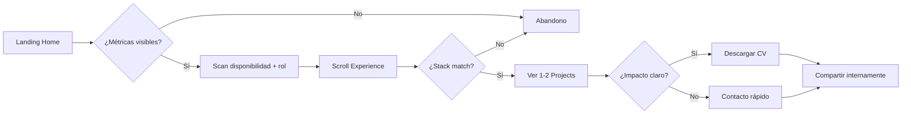
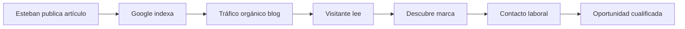

# UX Design — Portafolio Profesional & Marca Personal
## Esteban Maya | Software Engineer

| Campo | Valor |
|-------|-------|
| **Versión** | 1.0 |
| **Fecha** | 18 de junio de 2026 |
| **Autor** | UX Lead |
| **Estado** | Ready for Design Review |
| **Documentos relacionados** | [PRD.md](./PRD.md), [Architecture.md](./Architecture.md), [TechnicalDesign.md](./TechnicalDesign.md), [IDEA.html](./IDEA.html) |

---

## Tabla de contenidos

1. [Principios UX](#1-principios-ux)
2. [User Flows](#2-user-flows)
3. [Information Architecture](#3-information-architecture)
4. [Sitemap](#4-sitemap)
5. [Wireframes](#5-wireframes)
6. [Conversion Funnel](#6-conversion-funnel)
7. [Riesgos UX](#7-riesgos-ux)
8. [Apéndices](#8-apéndices)

---

## 1. Principios UX

| Principio | Aplicación | Persona beneficiada |
|-----------|------------|---------------------|
| **90-second rule** | Hero responde quién, qué, impacto y disponibilidad above the fold | Laura (recruiter) |
| **Scannable hierarchy** | Métricas, badges, timeline — no muros de texto | Laura, Carlos |
| **Progressive disclosure** | Home = teasers; profundidad en rutas dedicadas | Todas |
| **Dual intent paths** | Ruta "contratar" (Experience → Contact) vs "evaluar técnico" (Projects → Blog) | Laura vs Carlos |
| **Marca diferenciada** | Bio-bridge visible en About; no es "otro portafolio genérico" | Carlos, Ana |
| **Mobile-first** | 60%+ tráfico LinkedIn es móvil; CTAs thumb-reachable | Laura |
| **Zero dead-ends** | Cada página termina con CTA contextual hacia Contact o contenido relacionado | Todas |
| **Admin ≤ 15 min** | Publicar artículo en < 15 min (KPI PRD) | Esteban |

### Objetivos UX medibles (MVP)

| Métrica | Target | Instrumentación |
|---------|--------|-----------------|
| Time to first meaningful paint (hero) | < 1.5s mobile | Speed Insights |
| Bounce rate Home | < 45% | Analytics |
| Scroll depth Home → Projects CTA | ≥ 60% | Custom event |
| Contact CTA click rate | ≥ 3% sesiones | `cta_click` |
| Task success: encontrar CV | ≥ 95% | Test moderado |
| Admin: publish article E2E | < 15 min | Timer interno |

---

## 2. User Flows

### 2.1 Mapa de flujos (visión general)

```mermaid
flowchart TB
    subgraph Entry["Puntos de entrada"]
        LI[LinkedIn]
        GO[Google Search]
        GH[GitHub]
        SH[Share social]
        DI[Direct URL]
    end

    subgraph Public["Front Office"]
        HOME[/]
        ABOUT[/about]
        EXP[/experience]
        PROJ[/projects]
        BLOG[/blog]
        ART[/blog/slug]
        CONT[/contact]
    end

    subgraph Convert["Conversión"]
        CV[Descargar CV]
        EM[Email]
        LN[LinkedIn]
    end

    LI --> HOME
    GO --> ART
    GO --> HOME
    GH --> PROJ
    SH --> ART
    DI --> HOME

    HOME --> EXP
    HOME --> PROJ
    HOME --> BLOG
    HOME --> CONT
    HOME --> CV

    EXP --> PROJ
    EXP --> CONT
    PROJ --> GH
    PROJ --> CONT
    BLOG --> ART
    ART --> PROJ
    ART --> CONT
    ABOUT --> EXP
    ABOUT --> CONT

    CONT --> EM
    CONT --> LN
    HOME --> EM
    HOME --> LN
```

---

### 2.2 Flow 1 — Laura (Tech Recruiter): evaluación rápida

**Objetivo:** Decidir si pasa al hiring manager en < 90 segundos.
**Entry point:** Link en LinkedIn → Home.



| Paso | Pantalla | Acción | Decisión UX |
|------|----------|--------|-------------|
| 1 | Home | Scan hero: nombre, rol, badge disponibilidad | Badge verde/accent = señal inmediata |
| 2 | Home | Lee métrica destacada (60% mejora) | Número grande = hook emocional |
| 3 | Home → Experience | Nav o scroll; timeline 3 roles max visible | No requiere click para ver seniority |
| 4 | Experience | Scan tech badges por rol | Go, K8s, Postgres = match backend |
| 5 | Projects | 2 cards: problema/resultado | Valida profundidad sin leer todo |
| 6 | Home/Contact | Click "Descargar CV" o email | CV = conversión primaria recruiter |

**Tiempo objetivo:** 60–90s · **Páginas visitadas:** 2–3 · **Conversión:** CV download o email

---

### 2.3 Flow 2 — Carlos (Engineering Manager): evaluación técnica

**Objetivo:** Validar criterio de arquitectura y profundidad.
**Entry point:** Referido interno o LinkedIn → Projects o Blog.

```mermaid
flowchart TD
    A[Entry: /projects o /blog] --> B[Leer 1 proyecto completo]
    B --> C{¿Problema/solución/resultado convincente?}
    C -->|No| X[Abandono]
    C -->|Sí| D[Click GitHub]
    D --> E[Revisar código externo]
    E --> F[Volver → /blog]
    F --> G[Leer artículo técnico]
    G --> H{¿Calidad writing + profundidad?}
    H -->|Sí| I[/about → Bio-bridge]
    H -->|No| X
    I --> J[Contact o forward a recruiter]
```

| Paso | Pantalla | Acción | Decisión UX |
|------|----------|--------|-------------|
| 1 | Projects | Lee card completa: problema → solución → resultado | Formato case study, no lista de features |
| 2 | Projects | Click GitHub | Abre nueva pestaña; no pierde contexto |
| 3 | Blog | Elige artículo por tag (Arquitectura, Sistemas) | Tags = señal de especialización |
| 4 | Blog article | Lee con code blocks + headings | Syntax highlight; TOC en v1.1 |
| 5 | About | Bio-bridge table | Diferenciador: piensa en sistemas |
| 6 | Contact | Email o LinkedIn | Conversión secundaria pero cualificada |

**Tiempo objetivo:** 5–12 min · **Páginas visitadas:** 4–6 · **Conversión:** Contact o referido interno

---

### 2.4 Flow 3 — Ana (Dev comunidad): descubrimiento orgánico

**Objetivo:** Aprender de un artículo; opcionalmente descubrir al autor.
**Entry point:** Google → `/blog/[slug]`.

```mermaid
flowchart LR
    A[Google SERP] --> B[Click resultado]
    B --> C[/blog/slug]
    C --> D{¿Snippet + carga rápida?}
    D -->|No| X[Back to Google]
    D -->|Sí| E[Leer artículo]
    E --> F{¿Scroll > 50%?}
    F -->|Sí| G[Ver author box → About]
    F -->|No| X
    G --> H[/projects relacionado]
    H --> I[Compartir en Twitter/LinkedIn]
    I --> J[Follow / bookmark]
```

| Paso | Pantalla | Acción | Decisión UX |
|------|----------|--------|-------------|
| 1 | SERP | Ve title + meta description optimizados | SEO-05 del PRD |
| 2 | Article | Landing directa; sin popups | Zero friction |
| 3 | Article | Lee contenido; fecha + reading time visibles | Señales de frescura |
| 4 | Article footer | Author card: "Esteban Maya · Backend Engineer" | Bridge artículo → marca |
| 5 | Share | OG card atractiva al compartir | FO-11 |

**Tiempo objetivo:** 8–15 min lectura · **Conversión:** Share (awareness), no contacto laboral

---

### 2.5 Flow 4 — Esteban (Admin): publicar artículo

**Objetivo:** Escribir y publicar nota técnica sin tocar código.
**Entry point:** `/admin/login` → GitHub OAuth.

```mermaid
flowchart TD
    A[/admin/login] --> B[GitHub OAuth]
    B --> C{¿Whitelisted?}
    C -->|No| D[Error unauthorized]
    C -->|Sí| E[/admin dashboard]
    E --> F[/admin/articles/new]
    F --> G[Escribir MD + excerpt + tags]
    G --> H[Upload cover image]
    H --> I[Editar SEO fields]
    I --> J[Preview]
    J --> K{¿OK?}
    K -->|No| G
    K -->|Sí| L[Publish]
    L --> M[Toast success + revalidation]
    M --> N[Ver en /blog/slug]
```

| Paso | Pantalla | Acción | Tiempo target |
|------|----------|--------|---------------|
| 1 | Login | 1 click GitHub | 10s |
| 2 | Article form | Title, slug auto, excerpt | 2 min |
| 3 | Editor | Markdown content | 8–10 min |
| 4 | SEO panel | Title/description override (optional) | 1 min |
| 5 | Preview | Side-by-side o tab preview | 30s |
| 6 | Publish | 1 click + confirm | 5s |
| **Total** | | | **< 15 min** |

---

### 2.6 Flow 5 — Esteban (Admin): actualizar experiencia post-entrevista

```mermaid
flowchart LR
    A[/admin] --> B[/admin/experience]
    B --> C[Edit entry]
    C --> D[Update bullets + tech]
    D --> E[Save draft]
    E --> F[Preview /experience]
    F --> G[Publish visible]
```

**Frecuencia:** 1–2 veces/mes · **Tiempo target:** < 5 min

---

### 2.7 Estados de error y edge cases

| Escenario | Comportamiento UX |
|-----------|-------------------|
| 404 slug blog/project | Página amigable + links a Blog y Projects |
| OAuth no autorizado | Mensaje claro: "Cuenta no autorizada" + logout |
| Artículo draft en URL directa | 404 (no filtrar drafts) |
| CV no disponible | CTA deshabilitado + tooltip "Próximamente" |
| Formulario contacto fail (v1.1) | Inline error + fallback mailto |
| Red lenta | Skeleton screens en admin; public = SSR HTML visible |
| Mobile menu abierto | Trap focus; Escape cierra (IDEA.html) |

---

## 3. Information Architecture

### 3.1 Modelo mental

El sitio organiza la información en **tres capas cognitivas**:

```
┌─────────────────────────────────────────────────────────────┐
│  CAPA 1 — IDENTIDAD (quién soy)                             │
│  Home · About                                               │
├─────────────────────────────────────────────────────────────┤
│  CAPA 2 — CREDIBILIDAD (qué he hecho)                       │
│  Experience · Projects                                      │
├─────────────────────────────────────────────────────────────┤
│  CAPA 3 — PROFUNDIDAD + CONVERSIÓN (cómo pienso / actúa)    │
│  Blog (The Lab) · Contact                                   │
└─────────────────────────────────────────────────────────────┘
```

**Justificación:** los reclutadores consumen Capa 1–2; los EMs Capa 2–3; la comunidad Capa 3 con descubrimiento inverso hacia Capa 1.

### 3.2 Jerarquía de contenido

| Nivel | Tipo | Ejemplos |
|-------|------|----------|
| L0 | Site | estebanmaya.dev |
| L1 | Sección principal | Home, About, Experience, Projects, Blog, Contact |
| L2 | Colección | Lista proyectos, lista artículos |
| L3 | Item | `/projects/[slug]`, `/blog/[slug]` |
| L0-admin | Back office | `/admin/*` (no indexado, separado mentalmente) |

### 3.3 Taxonomía

#### Navegación primaria (header)

| Label nav | Ruta | Label alternativo | Notas |
|-----------|------|-------------------|-------|
| Inicio | `/` | — | Logo también lleva aquí |
| Sobre mí | `/about` | About | Bio + bio-bridge |
| Experiencia | `/experience` | Experience | Timeline |
| Proyectos | `/projects` | Projects | Grid cards |
| Blog | `/blog` | The Lab (subtitle) | Marca editorial en hero de sección |
| Contacto | `/contact` | Contact | CTA destacado en header |

#### Taxonomía Projects

| Dimensión | Valores | Filtrable (v1.1) |
|-----------|---------|------------------|
| category | "Backend · API", "Frontend · Real-time", "DevOps · Infra" | Sí |
| technology | Via Technology catalog | Sí |
| featured | boolean | No (solo Home) |

#### Taxonomía Blog (The Lab)

| Dimensión | Valores | Filtrable (v1.1) |
|-----------|---------|------------------|
| tags | Arquitectura, Sistemas, DevOps, Bio↔Tech | Sí |
| date | publishedAt | Sort desc |

### 3.4 Labeling conventions

| Regla | Ejemplo |
|-------|---------|
| Español en UI pública | "Sobre mí", "Proyectos", "Contacto" |
| Inglés en nav alternativo SEO | `<title>` puede ser bilingual en v1.2 |
| The Lab = subtítulo, no nav item | Header dice "Blog"; sección dice "The Lab — Notas técnicas" |
| Verbos en CTAs | "Ver proyectos", "Descargar CV", "Contactar" |
| Métricas con unidad | "−40%", "45 → 8 min", no solo "mejora" |

### 3.5 Matriz contenido × persona

| Contenido | Laura | Carlos | Ana | Esteban |
|-----------|-------|--------|-----|---------|
| Hero + metrics | ●●● | ●● | ● | ● |
| Experience | ●●● | ●● | ○ | ● |
| Projects | ●●● | ●●● | ●● | ● |
| About / bio-bridge | ● | ●●● | ● | ● |
| Blog | ○ | ●●● | ●●● | ● |
| Contact / CV | ●●● | ●● | ○ | ○ |
| Admin | ○ | ○ | ○ | ●●● |

●●● = crítico · ●● = importante · ● = secundario · ○ = irrelevante

---

## 4. Sitemap

### 4.1 Árbol visual (front office)

```
estebanmaya.dev
│
├── / ............................ Home
│   ├── [Hero + metrics]
│   ├── [Featured projects ×3]
│   └── [Latest articles ×3]
│
├── /about ....................... Sobre mí
│   ├── [Biografía]
│   ├── [Bio-bridge table]
│   └── [Intereses]
│
├── /experience .................. Experiencia
│   └── [Timeline entries ×N]
│
├── /projects .................... Proyectos
│   ├── /projects/[slug] ......... Detalle (v1.1)
│   └── [Project cards ×N]
│
├── /blog ........................ The Lab
│   ├── /blog/page/[n] ........... Paginación
│   └── /blog/[slug] ............. Artículo
│
├── /contact ..................... Contacto
│
├── /sitemap.xml ................. SEO (machine)
└── /robots.txt .................. SEO (machine)
```

### 4.2 Árbol visual (back office — no indexado)

```
/admin
├── /admin/login
├── /admin ....................... Dashboard
├── /admin/projects
│   ├── /admin/projects/new
│   └── /admin/projects/[id]
├── /admin/articles
│   ├── /admin/articles/new
│   └── /admin/articles/[id]
├── /admin/experience
│   └── /admin/experience/[id]
├── /admin/technologies
├── /admin/pages
│   ├── /admin/pages/hero
│   ├── /admin/pages/about
│   └── /admin/pages/contact
└── /admin/seo
```

### 4.3 Sitemap con prioridades SEO

| URL | Priority | changefreq | Index |
|-----|----------|------------|-------|
| `/` | 1.0 | weekly | ✓ |
| `/about` | 0.8 | monthly | ✓ |
| `/experience` | 0.8 | monthly | ✓ |
| `/projects` | 0.9 | weekly | ✓ |
| `/projects/[slug]` | 0.8 | monthly | ✓ v1.1 |
| `/blog` | 0.9 | weekly | ✓ |
| `/blog/[slug]` | 0.7 | weekly | ✓ |
| `/contact` | 0.6 | monthly | ✓ |
| `/admin/*` | — | — | ✗ |
| `/api/*` | — | — | ✗ |

### 4.4 Diagrama navegación global

```mermaid
graph TB
    subgraph Header["Header (sticky)"]
        LOGO[Esteban Maya]
        NAV[Inicio · Sobre mí · Experiencia · Proyectos · Blog]
        CTA[Contactar]
        SOC[GitHub · LinkedIn]
    end

    subgraph Footer["Footer"]
        CR[© 2026]
        FS[GitHub · LinkedIn · Email]
    end

    subgraph Main["Content Area"]
        PAGE[Página actual]
    end

    LOGO --> HOME[/]
    NAV --> HOME
    NAV --> ABOUT[/about]
    NAV --> EXP[/experience]
    NAV --> PROJ[/projects]
    NAV --> BLOG[/blog]
    CTA --> CONT[/contact]

    PAGE --> Main
    Header --> Main
    Main --> Footer
```

### 4.5 Cross-linking strategy (internal links)

| Desde | Hacia | Patrón UX |
|-------|-------|-----------|
| Home | Featured projects, latest articles | Teaser cards + "Ver todos →" |
| About | Experience | "Ver trayectoria completa →" |
| Experience | Projects | "Proyectos de este periodo" (v1.1) |
| Projects | Contact | CTA card al final del grid |
| Blog list | Article | Card click |
| Article | Related project | Inline link en MD |
| Article | Author → About | Author box footer |
| Article | Contact | Soft CTA "¿Trabajamos juntos?" |
| 404 | Home, Blog, Projects | Recovery links |

---

## 5. Wireframes

> Wireframes de baja fidelidad alineados a [IDEA.html](./IDEA.html). Breakpoint referencia: mobile 375px · desktop 1280px.

### 5.1 Home (`/`) — Desktop

```
┌──────────────────────────────────────────────────────────────────────────┐
│ [Esteban Maya]     Inicio  Sobre mí  Experiencia  Proyectos  Blog  [Contactar] │
├──────────────────────────────────────────────────────────────────────────┤
│                                                                          │
│  ┌─ ● Disponible · Software Engineer ─────────────────────────────────┐  │
│  │                                                                     │  │
│  │  Esteban Maya                              ┌─────────────────────┐  │  │
│  │  Software Engineer · Backend &             │                     │  │  │
│  │  Sistemas Distribuidos                     │     FOTO PERFIL     │  │  │
│  │                                            │                     │  │  │
│  │  Ingeniero con formación en Bioingeniería.  └─────────────────────┘  │  │
│  │  Diseño sistemas escalables...                                       │  │
│  │                                                                     │  │
│  │  ┌─ METRIC HIGHLIGHT ─────────────────────────────────────────────┐ │  │
│  │  │ 60% de mejora · Optimización de procesos                       │ │  │
│  │  │ 50 min → 10-30 min por unidad                                  │ │  │
│  │  └────────────────────────────────────────────────────────────────┘ │  │
│  │  ┌──────────────┐  ┌──────────────┐                                  │  │
│  │  │ Latencia −40%│  │ Deploy 45→8m │                                  │  │
│  │  └──────────────┘  └──────────────┘                                  │  │
│  │                                                                     │  │
│  │  [Ver proyectos]  [Descargar CV]                                    │  │
│  └─────────────────────────────────────────────────────────────────────┘  │
│                                                                          │
│  PROYECTOS DESTACADOS                                    [Ver todos →]   │
│  ┌─────────────────┐  ┌─────────────────┐  ┌─────────────────┐          │
│  │ Backend · API   │  │ Frontend        │  │ DevOps          │          │
│  │ HealthMetrics   │  │ Dashboard       │  │ Infra Pipeline  │          │
│  │ −35% latency    │  │ 500+ users      │  │ 45→8 min deploy │          │
│  └─────────────────┘  └─────────────────┘  └─────────────────┘          │
│                                                                          │
│  THE LAB · Últimas notas                                   [Ver blog →]  │
│  ┌─────────────────┐  ┌─────────────────┐  ┌─────────────────┐          │
│  │ Mar 2026        │  │ Feb 2026        │  │ Ene 2026        │          │
│  │ Hexagonal arch… │  │ Señales vs      │  │ Terraform…      │          │
│  │ Leer →          │  │ event streams   │  │ Leer →          │          │
│  └─────────────────┘  └─────────────────┘  └─────────────────┘          │
│                                                                          │
├──────────────────────────────────────────────────────────────────────────┤
│  © 2026 Esteban Maya          GitHub · LinkedIn · Email                  │
└──────────────────────────────────────────────────────────────────────────┘
```

### 5.2 Home — Mobile (375px)

```
┌─────────────────────────────┐
│ Esteban Maya            [≡] │
├─────────────────────────────┤
│ ● Disponible · SW Engineer  │
│                             │
│ Esteban Maya                │
│ Backend & Sistemas Distrib. │
│                             │
│ Bio corta 2-3 líneas...     │
│                             │
│ ┌─ 60% mejora ────────────┐ │
│ │ metric highlight        │ │
│ └─────────────────────────┘ │
│ ┌ Latencia ┐ ┌ Deploy    ┐  │
│ │  −40%    │ │ 45→8 min  │  │
│ └──────────┘ └───────────┘  │
│                             │
│ [Ver proyectos    ]          │
│ [Descargar CV     ]          │
│                             │
│ ┌─────────────────────────┐ │
│ │      FOTO PERFIL        │ │
│ └─────────────────────────┘ │
│                             │
│ PROYECTOS DESTACADOS        │
│ ┌─────────────────────────┐ │
│ │ HealthMetrics API       │ │
│ │ −35% · Go Redis         │ │
│ └─────────────────────────┘ │
│ (scroll horizontal o stack) │
│                             │
│ THE LAB                     │
│ ┌─────────────────────────┐ │
│ │ Hexagonal architecture  │ │
│ │ Leer →                  │ │
│ └─────────────────────────┘ │
├─────────────────────────────┤
│ © 2026 · GitHub · LinkedIn  │
└─────────────────────────────┘
```

**Notas mobile:** métricas antes de foto (contenido first); CTAs full-width min 44px height; hamburger con 6 nav items.

---

### 5.3 Experience (`/experience`)

```
┌──────────────────────────────────────────────────────────────┐
│ [Header]                                                     │
├──────────────────────────────────────────────────────────────┤
│  EXPERIENCIA                                                 │
│  Trayectoria profesional                                     │
│                                                              │
│  │                                                           │
│  ●──┌────────────────────────────────────────────────────┐  │
│  │  │ 2023 — Presente · TechCorp SaaS                    │  │
│  │  │ Senior Software Engineer                           │  │
│  │  │ • −40% latencia API                                │  │
│  │  │ • Monolito → microservicios                        │  │
│  │  │ [Go] [K8s] [PostgreSQL] [Redis] [AWS]              │  │
│  │  └────────────────────────────────────────────────────┘  │
│  │                                                           │
│  ○──┌────────────────────────────────────────────────────┐  │
│  │  │ 2021 — 2023 · DataFlow Inc                         │  │
│  │  │ Software Engineer                                  │  │
│  │  │ • 2M+ registros/día                                  │  │
│  │  │ [Node.js] [Kafka] [Docker]                         │  │
│  │  └────────────────────────────────────────────────────┘  │
│  │                                                           │
│  ○──┌────────────────────────────────────────────────────┐  │
│      │ 2019 — 2021 · BioSystems Lab                       │  │
│      │ ...                                                │  │
│      └────────────────────────────────────────────────────┘  │
│                                                              │
│  ┌─ CTA ─────────────────────────────────────────────────┐  │
│  │ ¿Interesado en mi perfil?  [Contactar]  [Ver proyectos]│  │
│  └─────────────────────────────────────────────────────────┘  │
├──────────────────────────────────────────────────────────────┤
│ [Footer]                                                     │
└──────────────────────────────────────────────────────────────┘
```

---

### 5.4 Projects (`/projects`)

```
┌──────────────────────────────────────────────────────────────┐
│ [Header]                                                     │
├──────────────────────────────────────────────────────────────┤
│  PROYECTOS                                                   │
│  Trabajo seleccionado                                        │
│                                                              │
│  ┌──────────────────────┐  ┌──────────────────────┐         │
│  │ Backend · API        │  │ Frontend · Real-time │         │
│  │ HealthMetrics API    │  │ Dashboard Platform   │         │
│  │                      │  │                      │         │
│  │ Problema:            │  │ Problema:            │         │
│  │ Latencias 2s+...     │  │ Datos dispersos...   │         │
│  │ Solución:            │  │ Solución:            │         │
│  │ Go + Redis + OpenAPI │  │ Next.js + WebSockets │         │
│  │ Resultado:           │  │ Resultado:           │         │
│  │ −35% · 99.95% uptime │  │ 500+ users           │         │
│  │                      │  │                      │         │
│  │ GitHub · Demo        │  │ GitHub · Demo        │         │
│  └──────────────────────┘  └──────────────────────┘         │
│                                                              │
│  ┌──────────────────────────────────────────────────────┐   │
│  │ DevOps · Infraestructura · Infra Pipeline (full width)│   │
│  └──────────────────────────────────────────────────────┘   │
├──────────────────────────────────────────────────────────────┤
│ [Footer]                                                     │
└──────────────────────────────────────────────────────────────┘
```

---

### 5.5 Blog list (`/blog`)

```
┌──────────────────────────────────────────────────────────────┐
│ [Header]                                                     │
├──────────────────────────────────────────────────────────────┤
│  THE LAB                                                     │
│  Notas técnicas y exploración                                │
│  Reflexiones sobre arquitectura, sistemas y ciencia + código │
│                                                              │
│  ┌─────────────┐  ┌─────────────┐  ┌─────────────┐        │
│  │[Arquitectura]│  │[Sistemas]   │  │[DevOps]     │        │
│  │ Mar 2026    │  │ Feb 2026    │  │ Ene 2026    │        │
│  │ Hexagonal…  │  │ Señales vs  │  │ Terraform…  │        │
│  │ excerpt...  │  │ streams…    │  │ excerpt...  │        │
│  │ 8 min · →   │  │ 6 min · →   │  │ 5 min · →   │        │
│  └─────────────┘  └─────────────┘  └─────────────┘        │
│                                                              │
│  [← Prev]  Page 1 of 2  [Next →]                            │
├──────────────────────────────────────────────────────────────┤
│ [Footer]                                                     │
└──────────────────────────────────────────────────────────────┘
```

---

### 5.6 Blog article (`/blog/[slug]`)

```
┌──────────────────────────────────────────────────────────────┐
│ [Header]                                                     │
├──────────────────────────────────────────────────────────────┤
│  Home › Blog › Hexagonal architecture en APIs de salud       │
│                                                              │
│  [Arquitectura]  Mar 2026  ·  8 min lectura                  │
│                                                              │
│  Hexagonal architecture en APIs de salud                     │
│  ─────────────────────────────────────                       │
│                                                              │
│  ┌─────────────────────────────────────────────────────┐    │
│  │ [Cover image opcional]                              │    │
│  └─────────────────────────────────────────────────────┘    │
│                                                              │
│  Intro párrafo hook...                                       │
│                                                              │
│  ## Contexto                                                 │
│  Texto + code block:                                         │
│  ┌─────────────────────────────────────────────────────┐    │
│  │ go ··· func HandleRequest() {                       │    │
│  └─────────────────────────────────────────────────────┘    │
│                                                              │
│  ## Solución                                                 │
│  ...                                                         │
│                                                              │
│  ┌─ Author box ─────────────────────────────────────────┐   │
│  │ [foto] Esteban Maya · Software Engineer               │   │
│  │ Backend & sistemas distribuidos.  [Sobre mí →]       │   │
│  └──────────────────────────────────────────────────────┘   │
│                                                              │
│  ┌─ Soft CTA ───────────────────────────────────────────┐   │
│  │ ¿Trabajamos juntos?  [Contactar]                     │   │
│  └──────────────────────────────────────────────────────┘   │
├──────────────────────────────────────────────────────────────┤
│ [Footer]                                                     │
└──────────────────────────────────────────────────────────────┘
```

---

### 5.7 Contact (`/contact`)

```
┌──────────────────────────────────────────────────────────────┐
│ [Header]                                                     │
├──────────────────────────────────────────────────────────────┤
│                                                              │
│           ┌────────────────────────────────────┐            │
│           │                                    │            │
│           │     ¿Trabajamos juntos?            │            │
│           │                                    │            │
│           │  Abierto a oportunidades backend,  │            │
│           │  platform engineering y arquitectura│            │
│           │                                    │            │
│           │  [ ✉ Email ]                       │            │
│           │  [ LinkedIn ]  [ GitHub ]          │            │
│           │                                    │            │
│           │  ─── v1.1 ───                      │            │
│           │  Nombre: [________]                │            │
│           │  Email:  [________]                │            │
│           │  Mensaje:[________]                │            │
│           │  [ Enviar ]                        │            │
│           └────────────────────────────────────┘            │
│                                                              │
├──────────────────────────────────────────────────────────────┤
│ [Footer]                                                     │
└──────────────────────────────────────────────────────────────┘
```

---

### 5.8 Admin — Article editor (`/admin/articles/[id]`)

```
┌──────────────────────────────────────────────────────────────────────────┐
│ [Admin]  Dashboard · Projects · Articles · Experience · Tech · SEO       │
├──────────────────────────────────────────────────────────────────────────┤
│  ← Articles    Edit: Hexagonal architecture          [Draft] [Publish]   │
├──────────────────────────────────────────────────────────────────────────┤
│                                                                          │
│  Title:    [Hexagonal architecture en APIs de salud________]             │
│  Slug:     hexagonal-architecture-health-api  (auto)                     │
│  Excerpt:  [160-320 chars________________________________] 142/320       │
│  Tags:     [Arquitectura] [+ Add]                                        │
│  Cover:    [Upload image]                                                │
│                                                                          │
│  ┌─ Content ──────────────────┬─ Preview ─────────────────────────────┐  │
│  │ ## Contexto                │ Contexto                              │  │
│  │ Lorem markdown...          │ Rendered HTML                         │  │
│  │ ```go                      │                                       │  │
│  │ func main() {}             │                                       │  │
│  │ ```                        │                                       │  │
│  └────────────────────────────┴───────────────────────────────────────┘  │
│                                                                          │
│  ▼ SEO Settings                                                          │
│  Meta title:       [override optional________________]                   │
│  Meta description: [override optional________________]                   │
│  OG image:         [Upload]                                              │
│  ☐ noindex                                                               │
│                                                                          │
│  [Preview live]  [Save draft]  [Publish ▶]                               │
└──────────────────────────────────────────────────────────────────────────┘
```

---

### 5.9 Componentes transversales

| Componente | Ubicación | Spec UX |
|------------|-----------|---------|
| Skip link | Top of page | Visible on focus; "Saltar al contenido" |
| Header sticky | Global public | 64px height; backdrop blur; active nav indicator |
| Side dock | Desktop XL (v1.1) | Fixed left; icon-only; tooltip on hover |
| Badge | Tags, tech | 12px font; pill shape |
| Card | Projects, blog | 12px radius; hover border accent |
| Metric highlight | Hero | Left border green; gradient bg |
| Toast | Admin | Success/error; auto-dismiss 5s |
| Empty state | Admin lists | Illustration + "Create first project" CTA |

---

## 6. Conversion Funnel

### 6.1 Funnel principal — Oportunidades laborales

**North Star (PRD):** Contactos laborales cualificados / mes.

```mermaid
funnel
    title Funnel conversión laboral
    section Awareness
        Visitas sitio: 2000
    section Interest
        Scroll > 50% Home: 1200
        Visit Experience o Projects: 800
    section Consideration
        Visit Contact o click CV: 200
    section Intent
        Click Email LinkedIn o CV: 80
    section Conversion
        Contacto cualificado: 20
```

*Volúmenes ilustrativos target 90 días post-launch.*

### 6.2 Etapas del funnel

| Etapa | Definición | Páginas clave | KPI | Target |
|-------|------------|---------------|-----|--------|
| **1. Awareness** | Visita cualquier página | Home, Blog (SEO) | Sesiones/mes | 500+ |
| **2. Interest** | Engage > 30s o > 50% scroll | Home, About | Bounce rate | < 45% |
| **3. Consideration** | Ve credibilidad | Experience, Projects | Pages/session | ≥ 2.5 |
| **4. Intent** | Acción de contacto | Contact, CV, Email | CTA click rate | ≥ 3% |
| **5. Conversion** | Contacto real | Email reply, form | Contactos/mes | ≥ 5 |

### 6.3 Micro-conversiones

| Micro-conversión | Trigger | Valor | Persona |
|------------------|---------|-------|---------|
| CV download | Click "Descargar CV" | Alto | Laura |
| GitHub click | Click repo en project | Medio | Carlos |
| LinkedIn click | Header/footer/contact | Alto | Laura |
| Email click | mailto CTA | Alto | Todas |
| Article share | Share nativo / copy link | Medio (awareness) | Ana |
| Blog → About | Author box click | Bajo-medio | Ana |
| Return visit | 2+ sesiones 30 días | Alto | Carlos |

### 6.4 Funnel por persona

#### Laura (Recruiter) — fast path

```
Home (10s) → Experience (30s) → CV Download
                    ↓
              Conversion: 60s total
```

**Optimizaciones:**
- CV visible en hero (no scroll)
- Disponibilidad badge above fold
- Métricas scannable

#### Carlos (EM) — deep path

```
Projects (3m) → GitHub (5m) → Blog (8m) → Contact
                                    ↓
                              Conversion: 1-2 sesiones
```

**Optimizaciones:**
- Case study format en projects
- GitHub links prominentes
- Author box en artículos

#### Ana (Community) — awareness path

```
Google → Article (10m) → Share
              ↓
        No labor conversion (OK)
        Brand awareness + SEO
```

### 6.5 CTA hierarchy

| Prioridad | CTA | Ubicación | Estilo |
|-----------|-----|-----------|--------|
| P0 | Contactar | Header, Contact page | btn-primary |
| P0 | Descargar CV | Hero, Home | btn-secondary |
| P1 | Ver proyectos | Hero | btn-primary |
| P1 | Email / LinkedIn | Contact, Footer | btn-primary / secondary |
| P2 | Leer nota | Blog cards | text link accent |
| P2 | GitHub | Projects, Footer | text link |

**Regla:** máximo 2 CTAs primarios visibles simultáneamente por viewport.

### 6.6 Funnel admin (contenido → inbound)



**Loop:** más contenido → más SEO → más awareness → más conversión. KPI: ≥ 1 artículo/mes.

---

## 7. Riesgos UX

### 7.1 Matriz de riesgos

| ID | Riesgo | Prob. | Impacto | Severidad | Mitigación |
|----|--------|-------|---------|-----------|------------|
| UX-R01 | **Hero no comunica valor en 5s** | Media | Alto | 🔴 Alta | Test 5-second; métricas above fold; badge disponibilidad |
| UX-R02 | **Migración SPA→multi-route desorienta** | Media | Medio | 🟡 Media | 301 desde anchors; breadcrumbs; nav consistente con IDEA.html |
| UX-R03 | **"Blog" vs "The Lab" confunde** | Alta | Bajo | 🟡 Media | Nav = "Blog"; sección = "The Lab" subtitle; no duplicar labels |
| UX-R04 | **Mobile: métricas below fold** | Media | Alto | 🔴 Alta | Reordenar mobile: metrics antes de foto (wireframe 5.2) |
| UX-R05 | **Projects sin detail page (MVP)** | Alta | Medio | 🟡 Media | Cards self-contained con problema/solución/resultado completo |
| UX-R06 | **Contact solo mailto (MVP)** | Media | Medio | 🟡 Media | mailto + LinkedIn prominentes; form v1.1 priorizado |
| UX-R07 | **Admin editor MD intimidante** | Baja | Bajo | 🟢 Baja | Preview side-by-side; Esteban es dev |
| UX-R08 | **Dark-only sin toggle** | Baja | Bajo | 🟢 Baja | WCAG AA contrast audit; no toggle MVP OK |
| UX-R09 | **Contenido placeholder en launch** | Media | Alto | 🔴 Alta | Launch blocker PRD; checklist contenido real |
| UX-R10 | **Blog abandonado visualmente** | Media | Alto | 🟡 Media | Fecha + reading time; mín 3 artículos launch; cadencia 1/mes |
| UX-R11 | **CV link roto (#)** | Alta | Alto | 🔴 Alta | Validar URL real pre-launch; CTA disabled si no hay CV |
| UX-R12 | **OG preview rota al compartir** | Media | Medio | 🟡 Media | Test LinkedIn Debugger por artículo; default OG image |
| UX-R13 | **Cognitive overload Home** | Media | Medio | 🟡 Media | Teasers max 3 projects + 3 articles; progressive disclosure |
| UX-R14 | **Admin/public UI inconsistency** | Media | Bajo | 🟢 Baja | Shared tokens; shadcn themed dark en admin |
| UX-R15 | **Accessibility keyboard nav** | Media | Alto | 🟡 Media | Audit WCAG; skip link; focus visible; reduced motion |
| UX-R16 | **ISR stale content post-edit** | Baja | Medio | 🟢 Baja | revalidateTag on publish; admin toast "Live in ~1min" |
| UX-R17 | **Bio-bridge tabla ilegible en mobile** | Media | Medio | 🟡 Media | Stack rows como cards (IDEA.html responsive pattern) |
| UX-R18 | **Funnel drop-off Experience→Contact** | Alta | Alto | 🔴 Alta | CTA contextual al final de Experience y Projects |
| UX-R19 | **SEO traffic landing sin context** | Media | Medio | 🟡 Media | Author box + soft CTA en artículos; breadcrumbs |
| UX-R20 | **Single language (ES) limita EM intl** | Media | Medio | 🟡 Media | v1.2 i18n EN; titles técnicos pueden ser EN |

### 7.2 Riesgos críticos — plan de acción

#### UX-R01 + UX-R04: First impression mobile

| Acción | Owner | Sprint |
|--------|-------|--------|
| Reordenar Home mobile: metrics → CTAs → photo | Design/Dev | S1 |
| Test 5-second con 5 reclutadores | UX | S2 |
| Lighthouse mobile LCP < 2.5s | Dev | S1 |

#### UX-R18: Funnel drop-off

| Acción | Owner | Sprint |
|--------|-------|--------|
| CTA card al final de Experience, Projects, Blog article | Design/Dev | S2 |
| Track `cta_click` events con page context | Dev | S3 |
| A/B hero CTA copy (v1.2) | UX | Post-MVP |

#### UX-R09 + UX-R11: Launch blockers

| Acción | Owner | Sprint |
|--------|-------|--------|
| Content migration checklist desde IDEA.html | Content | S8 |
| CV PDF uploaded + URL validada | Content | S8 |
| No deploy prod con placeholders | QA | S8 |

### 7.3 Assumptions a validar (research)

| Assumption | Método validación | Cuándo |
|------------|-------------------|--------|
| Recruiters deciden en < 90s | Moderated usability (n=5) | Pre-launch |
| Case study format preferred over bullet list | A/B or interview EM (n=3) | v1.1 |
| "Blog" nav label > "The Lab" | Card sort or analytics | Post-launch 30d |
| Markdown editor sufficient for admin | Task timer publish article | Sprint 5 |
| Contact mailto acceptable vs form | Survey recruiters | v1.1 |

### 7.4 Checklist UX pre-launch

- [ ] 5-second test Home con persona Laura
- [ ] Task completion: encontrar CV en < 30s
- [ ] Task completion: leer proyecto completo mobile
- [ ] Keyboard-only navigation full site
- [ ] Screen reader test Home + Article
- [ ] OG preview LinkedIn para Home + 1 article
- [ ] Contrast ratio ≥ 4.5:1 all text
- [ ] Touch targets ≥ 44×44px mobile
- [ ] 404 page con recovery links
- [ ] Admin publish E2E < 15 min
- [ ] No placeholder content en prod
- [ ] CV link funcional

---

## 8. Apéndices

### A. Mapping PRD User Stories → UX deliverables

| Story | UX artifact |
|-------|-------------|
| FO-01 Hero + metrics | Wireframe 5.1, 5.2; Flow Laura |
| FO-02 Navigation | Sitemap 4.1; IA 3.2 |
| FO-03 Bio-bridge | About wireframe; IA 3.1 |
| FO-06 Blog | Wireframes 5.5, 5.6; Flow Ana |
| FO-07 Contact | Wireframe 5.7; Funnel 6.1 |
| BO-03 Article CRUD | Wireframe 5.8; Flow Esteban |
| SEO-07 Breadcrumbs | Wireframe 5.6 |

### B. Design tokens UX (referencia IDEA.html)

| Token | Uso UX |
|-------|--------|
| accent `#c8bfff` | Links, active nav, badges destacados |
| metric-positive `#34d399` | Métricas positivas, disponibilidad |
| surface `#141416` | Cards, elevación visual |
| min-height CTA | 44px (touch target) |
| section-gap | 96px desktop / 64px mobile (ritmo vertical) |
| prose max-width | 65ch (legibilidad blog) |

### C. Responsive breakpoints

| Breakpoint | Layout changes |
|------------|----------------|
| < 768px | Hamburger nav; single column; stacked cards |
| 768–1024px | 2-col project grid; full nav |
| 1024–1280px | 2-col projects; 3-col blog |
| > 1280px | Side dock (v1.1); max-w-6xl container |

### D. Referencias

- [PRD.md](./PRD.md) — Personas, user stories, MVP scope
- [Architecture.md](./Architecture.md) — Bounded contexts, content model
- [TechnicalDesign.md](./TechnicalDesign.md) — Routes, components, admin modules
- [IDEA.html](./IDEA.html) — Visual reference prototype

---

*Documento vivo. Próxima revisión: usability test pre-launch (Sprint 8).*
